# C4 Level 3 — Component Diagram: App (the backend service)

The workflow service is the core of the platform. It wraps the Flowable 7.1 BPMN engine and exposes process, task, deployment, comment, and history APIs.

```mermaid
C4Component
    title App — Component Diagram

    Container_Ext(portals, "Admin and User Portal", "nginx proxies /api/** to this service")
    ContainerDb_Ext(postgres, "PostgreSQL", "Schema: workflow")
    System_Ext(flowableEngine, "Flowable Engine", "Embedded BPMN engine (in-process)")

    Container_Boundary(workflowSvc, "App") {

        Component(deployCtrl, "DeploymentController", "REST Controller", "POST /api/workflow/deployments (deploy BPMN)<br/>GET /api/workflow/deployments (list definitions)<br/>GET /api/workflow/deployments/{id}/bpmn (export XML)<br/>DELETE /api/workflow/deployments/{id}")

        Component(processCtrl, "ProcessController", "REST Controller", "POST /api/workflow/processes (start)<br/>GET /api/workflow/processes (list active)<br/>GET /api/workflow/processes/{id} (details)<br/>DELETE /api/workflow/processes/{id} (cancel)")

        Component(taskCtrl, "TaskController", "REST Controller", "GET /api/workflow/tasks (list/filter)<br/>GET /api/workflow/tasks/{id} (details)<br/>POST claim/unclaim/complete/delegate")

        Component(commentCtrl, "CommentController", "REST Controller", "GET /api/workflow/processes/{id}/comments<br/>POST /api/workflow/processes/{id}/comments")

        Component(historyCtrl, "HistoryController", "REST Controller", "GET /api/workflow/history/processes<br/>GET /api/workflow/history/tasks")
        Component(auditCtrl, "AuditController", "REST Controller", "GET /api/audit (filter by entity, user, event type, time)")
        Component(notifCtrl, "NotificationController", "REST Controller", "GET /api/notifications<br/>GET /api/notifications/unread-count<br/>PUT mark-read, mark-all-read")

        Component(deploySvc, "DeploymentService", "Service", "Deploys BPMN XML to Flowable, retrieves process definitions and BPMN XML")
        Component(processSvc, "ProcessService", "Service", "Starts/cancels process instances via Flowable RuntimeService, sets authenticated user for initiator")
        Component(taskSvc, "TaskService", "Service", "Claims, completes, delegates tasks via Flowable TaskService. Publishes task events.")
        Component(commentSvc, "CommentService", "Service", "CRUD for comments (JPA, not Flowable comments)")
        Component(historySvc, "ProcessHistoryService", "Service", "Queries Flowable HistoryService for completed processes/tasks")

        Component(notifSvc, "NotificationService", "Service", "Turns task events into in-app notification rows, in the caller's transaction; lists and marks them read")
        Component(auditSvc, "AuditService", "Service", "Records each domain event as an audit entry in the caller's transaction; queries the audit trail")
        Component(eventPub, "EventPublisher", "Service", "In-process dispatcher: hands each domain event to NotificationService, then AuditService")
        Component(eventListener, "FlowableEventListener", "Flowable Listener", "Listens to Flowable engine events (TASK_CREATED, TASK_ASSIGNED) and delegates to EventPublisher")
        Component(tenantResolver, "CurrentTenantIdResolver", "Hibernate filter parameter", "Supplies the tenant from TenantContext to the auto-enabled tenantFilter")
        Component(securityConfig, "SecurityConfig", "Spring Security", "OAuth2 resource server, JWT validation, public endpoint whitelist")

        Component(commentRepo, "CommentRepository", "JPA Repository", "CRUD for Comment entity")
    }

    Rel(portals, deployCtrl, "HTTP/JSON")
    Rel(portals, processCtrl, "HTTP/JSON")
    Rel(portals, taskCtrl, "HTTP/JSON")
    Rel(portals, commentCtrl, "HTTP/JSON")
    Rel(portals, historyCtrl, "HTTP/JSON")
    Rel(portals, notifCtrl, "HTTP/JSON")
    Rel(portals, auditCtrl, "HTTP/JSON")

    Rel(deployCtrl, deploySvc, "Calls")
    Rel(processCtrl, processSvc, "Calls")
    Rel(taskCtrl, taskSvc, "Calls")
    Rel(commentCtrl, commentSvc, "Calls")
    Rel(historyCtrl, historySvc, "Calls")
    Rel(auditCtrl, auditSvc, "Calls")
    Rel(notifCtrl, notifSvc, "Calls")

    Rel(deploySvc, flowableEngine, "RepositoryService")
    Rel(processSvc, flowableEngine, "RuntimeService, IdentityService")
    Rel(taskSvc, flowableEngine, "TaskService")
    Rel(historySvc, flowableEngine, "HistoryService")

    Rel(taskSvc, eventPub, "Publishes task.completed, task.delegated")
    Rel(processSvc, eventPub, "Publishes process.started")
    Rel(eventListener, eventPub, "Publishes task.created, task.assigned")
    Rel(eventPub, notifSvc, "notify(event)", "same transaction")
    Rel(eventPub, auditSvc, "record(event)", "same transaction")

    Rel(commentSvc, commentRepo, "JPA")
    Rel(commentRepo, postgres, "JDBC")

    UpdateLayoutConfig($c4ShapeInRow="4", $c4BoundaryInRow="1")
```

## Component Inventory

| Component | Type | Responsibility |
|-----------|------|---------------|
| DeploymentController | REST | BPMN deploy, list definitions, export XML, delete |
| ProcessController | REST | Start, list, get, cancel process instances |
| TaskController | REST | List, claim, unclaim, complete, delegate tasks |
| CommentController | REST | Add/list comments on process instances |
| HistoryController | REST | Query completed processes and tasks |
| NotificationController | REST | List notifications, unread count, mark read |
| AuditController | REST | Query the audit trail |
| DeploymentService | Service | Wraps Flowable RepositoryService |
| ProcessService | Service | Wraps Flowable RuntimeService + IdentityService |
| TaskService | Service | Wraps Flowable TaskService, publishes events |
| CommentService | Service | JPA-based comment CRUD |
| ProcessHistoryService | Service | Wraps Flowable HistoryService |
| NotificationService | Service | Creates in-app notifications from task events in the same transaction; reads and marks them |
| AuditService | Service | Records audit entries from events in the same transaction; serves `/api/audit` |
| EventPublisher | Service | In-process dispatcher to NotificationService and AuditService |
| FlowableEventListener | Engine Listener | Bridges Flowable engine events to EventPublisher |
| CurrentTenantIdResolver | Hibernate filter parameter | Supplies the tenant from `TenantContext` to the auto-enabled `tenantFilter` |
| SecurityConfig | Config | OAuth2 JWT resource server setup |

## Notes for Editors

- **Adding a new endpoint group** (e.g., Attachments API): Add a Controller + Service component pair, connect the controller to the portals and the service to the relevant repository/Flowable service.
- **Flowable stays in `com.wfp.workflow.engine.flowable`**: DeploymentService, ProcessService, TaskService, ProcessHistoryService, FlowableEventListener, FlowableConfig and FlowableExceptionHandler live there, and `EngineBoundaryTest` (ArchUnit) fails the build if any other main class depends on `org.flowable`.
- **Adding a new event type**: Update EventPublisher with the new publish method, update FlowableEventListener if it originates from the engine, and add the event class to `com.wfp.workflow.event`.
- **Flowable engine is embedded** (in-process, not a separate container). It uses the same PostgreSQL schema (`workflow`) and manages its own `ACT_*` tables alongside the application's `wf_*` tables.
