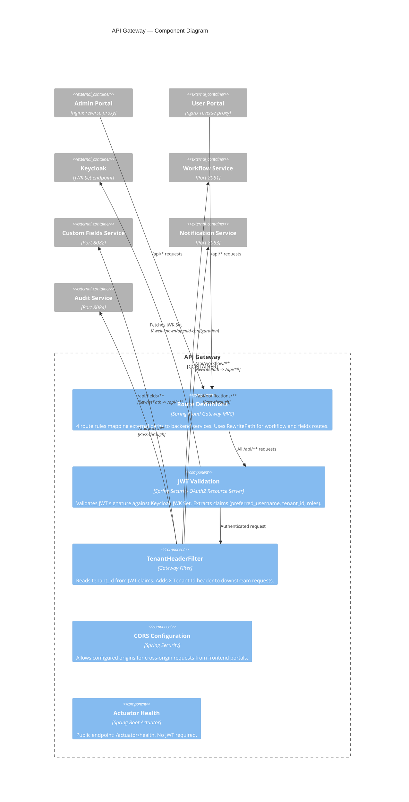

# C4 Level 3 — Component Diagram: API Gateway

The gateway is a thin routing + security layer with no database. It validates JWTs, extracts the tenant ID, and routes requests to backend services.



## Request Flow

```
Browser -> nginx (frontend) -> Gateway:9080
  1. Route matcher selects backend based on path prefix
  2. JWT filter validates token signature via Keycloak JWK Set
  3. TenantHeaderFilter extracts tenant_id claim -> X-Tenant-Id header
  4. RewritePath (if applicable) transforms the URL
  5. Request forwarded to backend service with Authorization + X-Tenant-Id headers
```

## Key Design Decisions

| Decision | Rationale |
|----------|-----------|
| No database | Gateway is stateless — all state lives in JWTs and downstream services |
| Excludes `DataSourceAutoConfiguration` | `wfp-security` lib pulls in JPA transitively; gateway must opt out |
| Named env vars for service URLs | Avoids partial route override bugs from indexed Spring Gateway env vars |
| No RewritePath for notification/audit | These services expose paths that already match the gateway's external paths |

## Notes for Editors

- **Adding a new backend route**: Add a route entry in `application.yml` under `spring.cloud.gateway.mvc.routes`. Decide whether the service needs `RewritePath` or can use pass-through.
- **Adding rate limiting or circuit breaking**: Add Spring Cloud Gateway filters to the route definitions.
- **Switching to service discovery**: Replace hard-coded `uri` values with `lb://service-name` and add a discovery client (Eureka, Consul, or Kubernetes).
