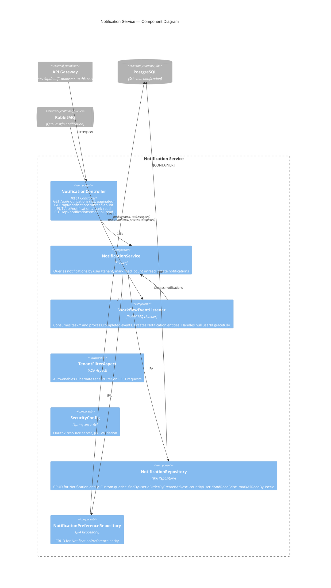

# C4 Level 3 — Component Diagram: Notification Service

The notification service is entirely event-driven. It has no synchronous producers — all notifications are created by consuming RabbitMQ events from the workflow service.

## Event-to-Notification Mapping

| Incoming Event | Notification Type | Target User | Reference |
|---------------|-------------------|-------------|-----------|
| `TaskCreatedEvent` | `TASK_ASSIGNED` | Task assignee | taskId |
| `TaskAssignedEvent` | `TASK_ASSIGNED` | Task assignee | taskId |
| `TaskCompletedEvent` | `TASK_COMPLETED` | User who completed | taskId |
| `ProcessCompletedEvent` | `PROCESS_COMPLETED` | Process initiator | processInstanceId |

## Notes for Editors

- **Adding a notification channel** (e.g., email, WebSocket push): Add a new component (e.g., `EmailSender`) called by `NotificationService.createNotification()`. Gate it with `NotificationPreference.emailEnabled`.
- **Adding new event types**: Update `WorkflowEventListener` with a new handler method. The queue binding (`task.*`, `process.completed`) may need expanding if the new event uses a different routing key prefix.
- **NotificationPreference** is defined but not yet enforced in the event listener — the preference check is a planned enhancement.
