# C4 Level 3 — Component Diagram: Workflow Service

The workflow service is the core of the platform. It wraps the Flowable 7.1 BPMN engine and exposes process, task, deployment, comment, and history APIs.

```mermaid
C4Component
    title Workflow Service — Component Diagram

    Container_Ext(gateway, "API Gateway", "Routes /api/workflow/** to this service")
    ContainerDb_Ext(postgres, "PostgreSQL", "Schema: workflow")
    ContainerQueue_Ext(rabbitmq, "RabbitMQ", "Exchange: wfp.events")
    System_Ext(flowableEngine, "Flowable Engine", "Embedded BPMN engine (in-process)")

    Container_Boundary(workflowSvc, "Workflow Service") {

        Component(deployCtrl, "DeploymentController", "REST Controller", "POST /api/deployments (deploy BPMN)<br/>GET /api/deployments (list definitions)<br/>GET /api/deployments/{id}/bpmn (export XML)<br/>DELETE /api/deployments/{id}")

        Component(processCtrl, "ProcessController", "REST Controller", "POST /api/processes (start)<br/>GET /api/processes (list active)<br/>GET /api/processes/{id} (details)<br/>DELETE /api/processes/{id} (cancel)")

        Component(taskCtrl, "TaskController", "REST Controller", "GET /api/tasks (list/filter)<br/>GET /api/tasks/{id} (details)<br/>POST claim/unclaim/complete/delegate")

        Component(commentCtrl, "CommentController", "REST Controller", "GET /api/processes/{id}/comments<br/>POST /api/processes/{id}/comments")

        Component(historyCtrl, "HistoryController", "REST Controller", "GET /api/history/processes<br/>GET /api/history/tasks")

        Component(deploySvc, "DeploymentService", "Service", "Deploys BPMN XML to Flowable, retrieves process definitions and BPMN XML")
        Component(processSvc, "ProcessService", "Service", "Starts/cancels process instances via Flowable RuntimeService, sets authenticated user for initiator")
        Component(taskSvc, "TaskService", "Service", "Claims, completes, delegates tasks via Flowable TaskService. Publishes task events.")
        Component(commentSvc, "CommentService", "Service", "CRUD for comments (JPA, not Flowable comments)")
        Component(historySvc, "ProcessHistoryService", "Service", "Queries Flowable HistoryService for completed processes/tasks")

        Component(eventPub, "EventPublisher", "Service", "Publishes domain events to RabbitMQ. Handles null RabbitTemplate gracefully in test contexts.")
        Component(eventListener, "FlowableEventListener", "Flowable Listener", "Listens to Flowable engine events (TASK_CREATED, TASK_ASSIGNED, PROCESS_COMPLETED) and delegates to EventPublisher")
        Component(tenantAspect, "TenantFilterAspect", "AOP Aspect", "Enables Hibernate tenant filter on every request using TenantContext")
        Component(securityConfig, "SecurityConfig", "Spring Security", "OAuth2 resource server, JWT validation, public endpoint whitelist")

        Component(processMetaRepo, "ProcessMetadataRepository", "JPA Repository", "CRUD for ProcessMetadata entity")
        Component(commentRepo, "CommentRepository", "JPA Repository", "CRUD for Comment entity")
        Component(attachmentRepo, "AttachmentRepository", "JPA Repository", "CRUD for Attachment entity")
    }

    Rel(gateway, deployCtrl, "HTTP/JSON")
    Rel(gateway, processCtrl, "HTTP/JSON")
    Rel(gateway, taskCtrl, "HTTP/JSON")
    Rel(gateway, commentCtrl, "HTTP/JSON")
    Rel(gateway, historyCtrl, "HTTP/JSON")

    Rel(deployCtrl, deploySvc, "Calls")
    Rel(processCtrl, processSvc, "Calls")
    Rel(taskCtrl, taskSvc, "Calls")
    Rel(commentCtrl, commentSvc, "Calls")
    Rel(historyCtrl, historySvc, "Calls")

    Rel(deploySvc, flowableEngine, "RepositoryService")
    Rel(processSvc, flowableEngine, "RuntimeService, IdentityService")
    Rel(taskSvc, flowableEngine, "TaskService")
    Rel(historySvc, flowableEngine, "HistoryService")

    Rel(taskSvc, eventPub, "Publishes task.completed, task.delegated")
    Rel(processSvc, eventPub, "Publishes process.started, process.cancelled")
    Rel(eventListener, eventPub, "Publishes task.created, task.assigned, process.completed")
    Rel(eventPub, rabbitmq, "AMQP", "Routing keys: task.*, process.*")

    Rel(commentSvc, commentRepo, "JPA")
    Rel(processMetaRepo, postgres, "JDBC")
    Rel(commentRepo, postgres, "JDBC")
    Rel(attachmentRepo, postgres, "JDBC")

    UpdateLayoutConfig($c4ShapeInRow="4", $c4BoundaryInRow="1")
```

## Component Inventory

| Component | Type | Responsibility |
|-----------|------|---------------|
| DeploymentController | REST | BPMN deploy, list definitions, export XML, delete |
| ProcessController | REST | Start, list, get, cancel process instances |
| TaskController | REST | List, claim, unclaim, complete, delegate tasks |
| CommentController | REST | Add/list comments on process instances |
| HistoryController | REST | Query completed processes and tasks |
| DeploymentService | Service | Wraps Flowable RepositoryService |
| ProcessService | Service | Wraps Flowable RuntimeService + IdentityService |
| TaskService | Service | Wraps Flowable TaskService, publishes events |
| CommentService | Service | JPA-based comment CRUD |
| ProcessHistoryService | Service | Wraps Flowable HistoryService |
| EventPublisher | Service | Publishes events to RabbitMQ (null-safe for tests) |
| FlowableEventListener | Engine Listener | Bridges Flowable engine events to EventPublisher |
| TenantFilterAspect | AOP | Auto-enables Hibernate `tenantFilter` per request |
| SecurityConfig | Config | OAuth2 JWT resource server setup |

## Notes for Editors

- **Adding a new endpoint group** (e.g., Attachments API): Add a Controller + Service component pair, connect the controller to the gateway and the service to the relevant repository/Flowable service.
- **Adding a new event type**: Update EventPublisher with the new publish method, update FlowableEventListener if it originates from the engine, and add the event class to `libs/wfp-events/`.
- **Flowable engine is embedded** (in-process, not a separate container). It uses the same PostgreSQL schema (`workflow`) and manages its own `ACT_*` tables alongside the application's `wf_*` tables.
