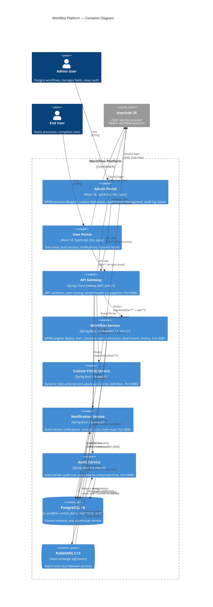

# C4 Level 2 — Container Diagram

Shows all deployable units (containers) within the Workflow Platform and their interactions.

## Container Inventory

| Container | Technology | Port | Database Schema | Description |
|-----------|-----------|------|----------------|-------------|
| Admin Portal | React 18 + nginx | 5173 (host) | - | Process designer, field editor, audit viewer |
| User Portal | React 18 + nginx | 5174 (host) | - | Task inbox, start process, notifications |
| API Gateway | Spring Cloud Gateway MVC | 9080 (host) / 8080 | - (no DB) | JWT validation, routing, tenant propagation |
| Workflow Service | Spring Boot + Flowable 7.1 | 8081 | `workflow` | BPMN engine, process/task lifecycle |
| Custom Fields Service | Spring Boot | 8082 | `custom_fields` | Dynamic field schemas & values |
| Notification Service | Spring Boot | 8083 | `notification` | Event-driven notifications |
| Audit Service | Spring Boot | 8084 | `audit` | Event-driven audit trail |
| PostgreSQL | PostgreSQL 16 | 5433 (host) / 5432 | all 5 schemas | Shared database instance |
| RabbitMQ | RabbitMQ 3.13 | 5672 / 15672 | - | Async event bus |
| Keycloak | Keycloak 25 | 8180 (host) / 8080 | `keycloak` | OIDC identity provider |

## Gateway Routing Rules

| External Path | Target Service | Rewrite Rule |
|---------------|---------------|-------------|
| `/api/workflow/**` | workflow-service:8081 | `RewritePath=/api/workflow(?:/(?<segment>.*))?$, /api/${segment}` |
| `/api/fields/**` | custom-fields-service:8082 | `RewritePath=/api/fields(?:/(?<segment>.*))?$, /api/${segment}` |
| `/api/notifications/**` | notification-service:8083 | Pass-through (no rewrite) |
| `/api/audit/**` | audit-service:8084 | Pass-through (no rewrite) |

## Event Flows (RabbitMQ)

| Producer | Routing Key | Consumer(s) | Purpose |
|----------|------------|-------------|---------|
| Workflow Service | `process.started` | Audit Service | Audit trail |
| Workflow Service | `process.completed` | Notification Service, Audit Service | User notification + audit |
| Workflow Service | `process.cancelled` | Audit Service | Audit trail |
| Workflow Service | `task.created` | Notification Service, Audit Service | New task notification + audit |
| Workflow Service | `task.assigned` | Notification Service, Audit Service | Assignment notification + audit |
| Workflow Service | `task.completed` | Notification Service, Audit Service | Completion notification + audit |
| Workflow Service | `task.delegated` | Notification Service, Audit Service | Delegation notification + audit |

## Notes for Editors

- **Adding a new service**: Add a `Container` node, a `Rel` to `postgres` (with its schema name), a `Rel` from `gateway`, and update the gateway routing table. If it consumes events, add a `Rel` from `rabbitmq`.
- **Adding direct inter-service calls**: Currently services communicate only via RabbitMQ (async). If you add synchronous service-to-service HTTP calls, add `Rel` edges between the service containers and note the coupling trade-off.
- **Splitting the database**: If a service needs its own PostgreSQL instance, replace the single `ContainerDb` with multiple and update the `Rel` edges accordingly.
