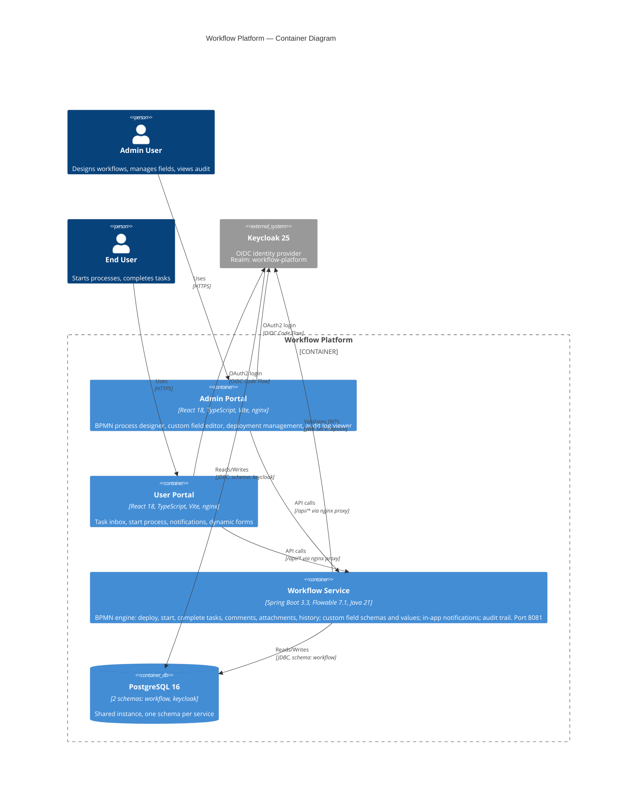

# C4 Level 2 — Container Diagram

Shows all deployable units (containers) within the Workflow Platform and their interactions.

```mermaid
C4Container
    title Workflow Platform — Container Diagram

    Person(admin, "Admin User", "Designs workflows, manages fields, views audit")
    Person(endUser, "End User", "Starts processes, completes tasks")

    System_Ext(keycloak, "Keycloak 25", "OIDC identity provider<br/>Realm: workflow-platform")

    Container_Boundary(wfp, "Workflow Platform") {

        Container(adminPortal, "Admin Portal", "React 18, TypeScript, Vite, nginx", "BPMN process designer, custom field editor, deployment management, audit log viewer")
        Container(userPortal, "User Portal", "React 18, TypeScript, Vite, nginx", "Task inbox, start process, notifications, dynamic forms")

        Container(workflowSvc, "Workflow Service", "Spring Boot 3.3, Flowable 7.1, Java 21", "BPMN engine: deploy, start, complete tasks, comments, attachments, history; custom field schemas and values; in-app notifications; audit trail. Port 8081")

        ContainerDb(postgres, "PostgreSQL 16", "2 schemas: workflow, keycloak", "Shared instance, one schema per service")
    }

    Rel(admin, adminPortal, "Uses", "HTTPS")
    Rel(endUser, userPortal, "Uses", "HTTPS")

    Rel(adminPortal, workflowSvc, "API calls", "/api/* via nginx proxy")
    Rel(userPortal, workflowSvc, "API calls", "/api/* via nginx proxy")
    Rel(adminPortal, keycloak, "OAuth2 login", "OIDC Code Flow")
    Rel(userPortal, keycloak, "OAuth2 login", "OIDC Code Flow")

    Rel(workflowSvc, keycloak, "Validates JWTs", "JWK Set endpoint")

    Rel(workflowSvc, postgres, "Reads/Writes", "JDBC, schema: workflow")
    Rel(keycloak, postgres, "Reads/Writes", "JDBC, schema: keycloak")


    UpdateLayoutConfig($c4ShapeInRow="4", $c4BoundaryInRow="1")
```

## Container Inventory

| Container | Technology | Port | Database Schema | Description |
|-----------|-----------|------|----------------|-------------|
| Admin Portal | React 18 + nginx | 5173 (host) | - | Process designer, field editor, audit viewer |
| User Portal | React 18 + nginx | 5174 (host) | - | Task inbox, start process, notifications |
| Workflow Service | Spring Boot + Flowable 7.1 | 8081 | `workflow` | BPMN engine, process/task lifecycle, custom fields, notifications, audit |
| PostgreSQL | PostgreSQL 16 | 5433 (host) / 5432 | all 2 schemas | Shared database instance |
| Keycloak | Keycloak 25 | 8180 (host) / 8080 | `keycloak` | OIDC identity provider |

## API Routing

The portals' nginx proxies `/api/` to workflow-service unchanged; the service serves `/api/workflow/**`, `/api/fields/**`, `/api/notifications/**` and `/api/audit/**` itself.

## Events

Workflow Service is the only producer and consumer. `EventPublisher` hands each event (`process.started`, `task.created`, `task.assigned`, `task.completed`, `task.delegated`) to `NotificationService` and `AuditService`, which write their rows in the same transaction as the change. There is no message broker.

## Notes for Editors

- **Adding a new service**: Add a `Container` node, a `Rel` to `postgres` (with its schema name), and the `Rel` edges from the portals. 
- **Splitting the database**: If a service needs its own PostgreSQL instance, replace the single `ContainerDb` with multiple and update the `Rel` edges accordingly.
