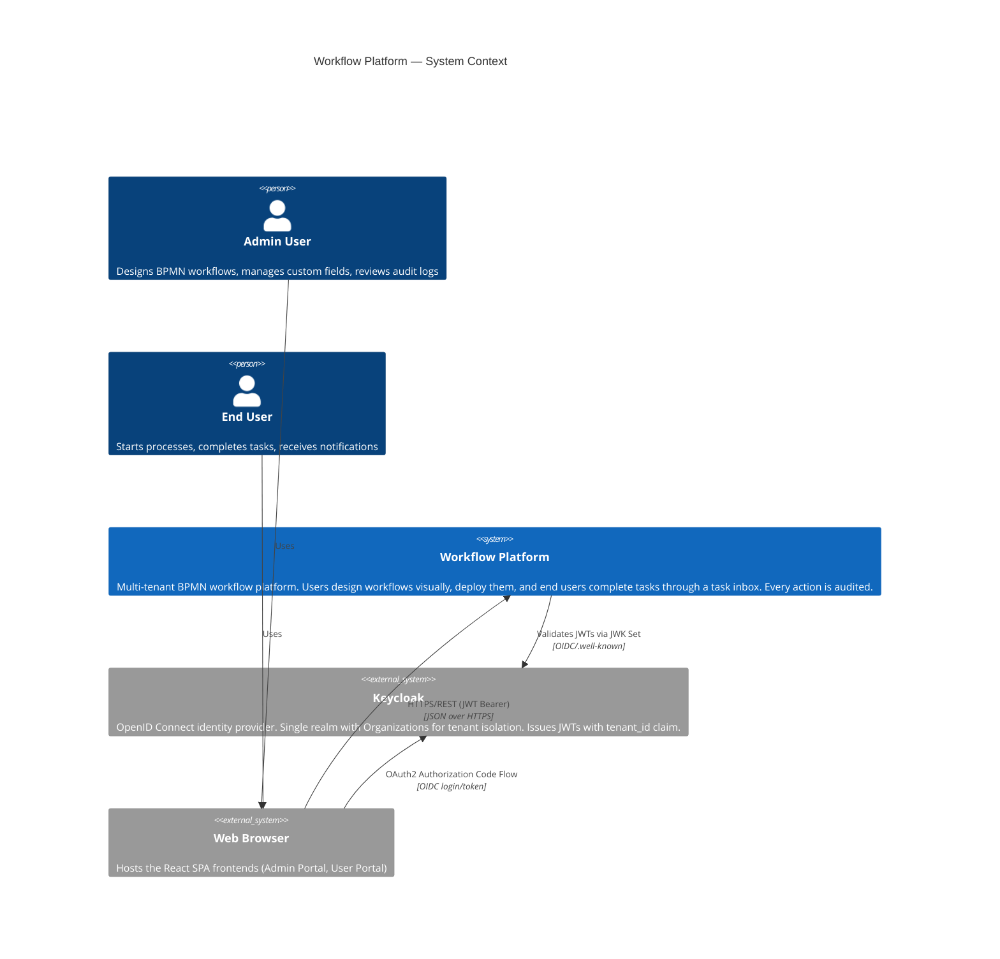

# C4 Level 1 — System Context Diagram

Shows the Workflow Platform as a single system and its relationships with users and external systems.

## Actors

| Actor | Role | Interactions |
|-------|------|-------------|
| **Admin User** | Process designer, platform administrator | Deploy BPMN processes, configure custom field schemas, view audit trail |
| **End User** | Day-to-day workflow participant | Start processes, claim/complete tasks, view notifications |

## External Systems

| System | Purpose | Protocol |
|--------|---------|----------|
| **Keycloak** | Identity & access management, multi-tenant isolation via Organizations | OIDC, JWT, JWK Set |
| **Web Browser** | Hosts React SPAs that communicate with the platform API | HTTPS |

## Notes for Editors

- If you add a new external integration (e.g., email provider, external API), add it as a `System_Ext` node and a `Rel` edge.
- If you split the platform into separately deployable products, promote them from one `System` box to multiple `System` boxes at this level.
