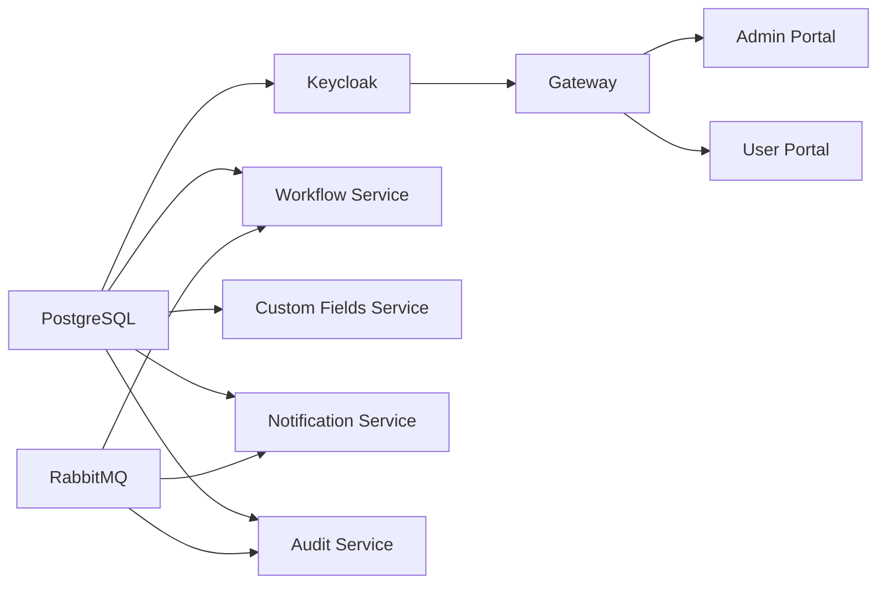
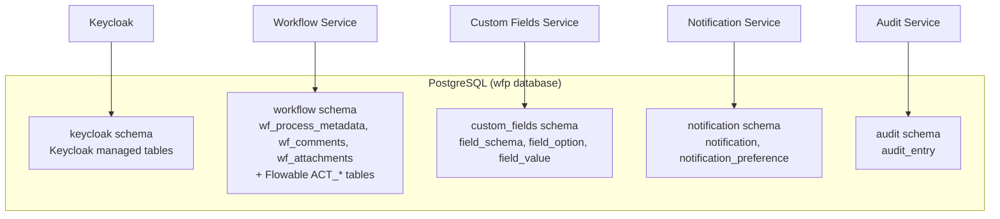
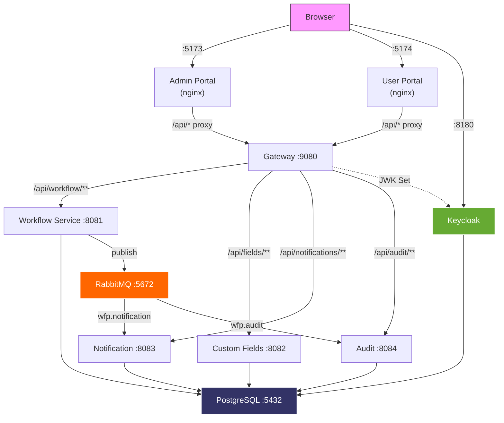
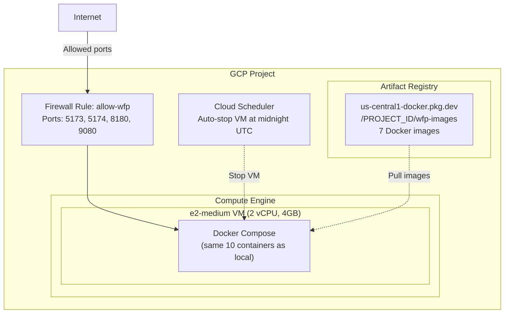
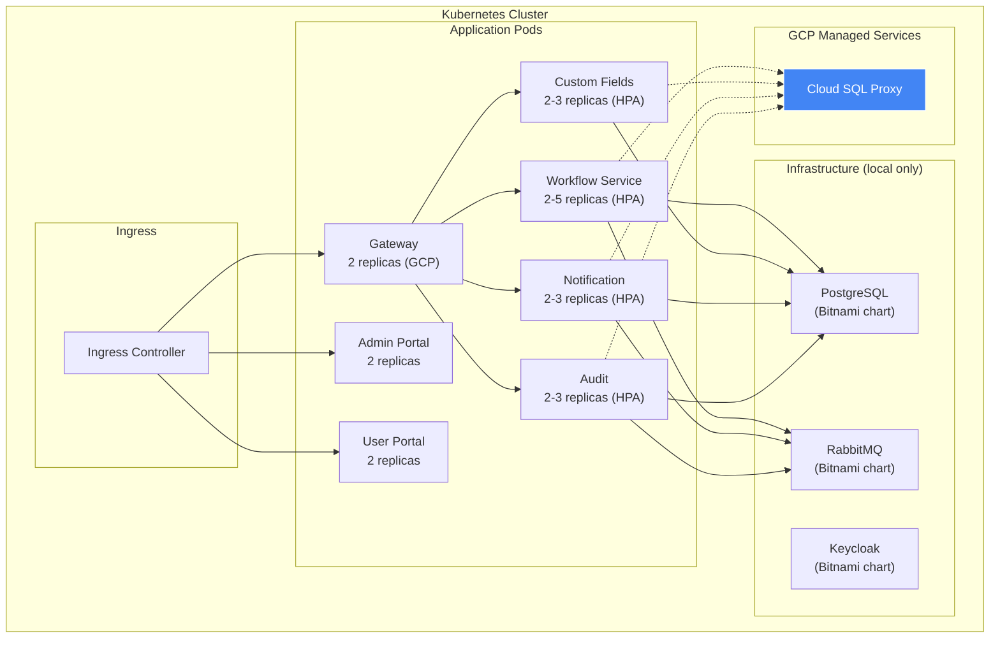

# C4 Level 4 — Deployment Diagrams

Two deployment topologies: Docker Compose (local dev) and GCP (production-like).

## Docker Compose Deployment

Local development stack — 10 containers on a single Docker host.

### Docker Compose — Port Mapping & Dependencies

| Container | Image | Host Port | Container Port | Depends On |
|-----------|-------|-----------|---------------|------------|
| `wfp-postgres` | postgres:16-alpine | 5433 | 5432 | - |
| `wfp-rabbitmq` | rabbitmq:3.13-management-alpine | 5672, 15672 | 5672, 15672 | - |
| `wfp-keycloak` | quay.io/keycloak/keycloak:25.0.6 | 8180 | 8080 | postgres (healthy) |
| `wfp-gateway` | wfp/gateway | 9080 | 8080 | keycloak (started) |
| `wfp-workflow` | wfp/workflow-service | - | 8081 | postgres (healthy), rabbitmq (healthy) |
| `wfp-custom-fields` | wfp/custom-fields-service | - | 8082 | postgres (healthy) |
| `wfp-notification` | wfp/notification-service | - | 8083 | postgres (healthy), rabbitmq (healthy) |
| `wfp-audit` | wfp/audit-service | - | 8084 | postgres (healthy), rabbitmq (healthy) |
| `wfp-admin-portal` | wfp/admin-portal | 5173 | 80 | gateway (started) |
| `wfp-user-portal` | wfp/user-portal | 5174 | 80 | gateway (started) |

### Startup Order

### Database Schemas

Single PostgreSQL instance with 5 schemas:

### Network Topology (Docker)

---

## GCP Deployment

Single Compute Engine VM running the same Docker Compose stack.

### GCP Configuration

| Resource | Spec | Notes |
|----------|------|-------|
| VM Instance | `e2-medium` (2 vCPU, 4GB) | Min viable for 10 containers; e2-small causes OOM |
| Disk | 30 GB `pd-standard` | OS + Docker images + data |
| Region | `us-central1-a` | - |
| Firewall | Ports 5173, 5174, 8180, 9080 | Tag: `wfp-server` |
| Auto-stop | Cloud Scheduler at midnight UTC | Cost savings (~$1/month when stopped) |
| Running cost | ~$25/month | e2-medium on-demand |

### GCP-Specific Overrides

| Config | Local Value | GCP Value |
|--------|------------|-----------|
| JWT Issuer URI | `http://localhost:8180/...` | `http://{EXTERNAL_IP}:8180/...` |
| Keycloak `KC_HOSTNAME` | `localhost` | `{EXTERNAL_IP}` |
| Frontend `VITE_KEYCLOAK_URL` | `http://localhost:8180` | `http://{EXTERNAL_IP}:8180` |

---

## Kubernetes Deployment (Helm)

Umbrella Helm chart with 10 sub-charts. Supports local (minikube) and GCP production profiles.

### Helm Values Profiles

| Profile | File | Infra Charts | Replicas | Autoscaling |
|---------|------|-------------|----------|-------------|
| Local | `values-local.yaml` | Enabled (Bitnami PG, RMQ, KC) | 1 each | No |
| GCP | `values-gcp.yaml` | Disabled (managed services) | 2+ each | Yes (HPA) |

### Resource Allocation (GCP)

| Service | CPU Request | CPU Limit | Memory Request | Memory Limit | Min/Max Replicas |
|---------|------------|-----------|---------------|-------------|-----------------|
| Gateway | 250m | 500m | 256Mi | 512Mi | 2 / 5 |
| Workflow Service | 500m | 1000m | 512Mi | 1Gi | 2 / 5 |
| Custom Fields | 250m | 500m | 512Mi | 1Gi | 2 / 3 |
| Notification | 250m | 500m | 512Mi | 1Gi | 2 / 3 |
| Audit | 250m | 500m | 512Mi | 1Gi | 2 / 3 |
| Admin Portal | 50m | 200m | 64Mi | 128Mi | 2 / - |
| User Portal | 50m | 200m | 64Mi | 128Mi | 2 / - |

## Notes for Editors

- **Adding a new service to Docker Compose**: Add the service definition to `docker/docker-compose.yml`, create its Dockerfile, and add the schema to `docker/init-db.sql` if it needs a database.
- **Adding a new service to Helm**: Create a sub-chart under `helm/charts/`, add it as a dependency in `helm/workflow-platform/Chart.yaml`, and add its configuration to both `values-local.yaml` and `values-gcp.yaml`.
- **Switching GCP from VM to GKE**: Replace the Compute Engine section with a GKE cluster, use the Helm chart for deployment, and switch to Cloud SQL (via proxy) + Cloud Memorystore for RabbitMQ.
- **Adding a CDN or Load Balancer**: Insert it before the frontend containers in the network topology diagram.
