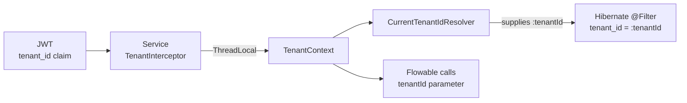
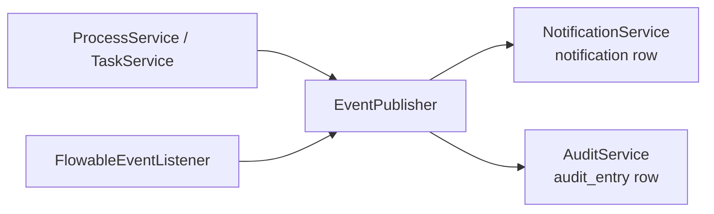

# Architecture Concepts

The ideas you need to hold in your head to work on this repo, and why they are built this way. Diagrams for each level are in the other files in this folder; known pitfalls are in `CLAUDE.md`.

## Multi-Tenancy

Every request carries a tenant id. It originates in the JWT and is enforced at four
separate layers — a break in any one of them is a cross-tenant data leak.

### The chain



| Layer | Mechanism | Lives in |
|---|---|---|
| Request | `TenantInterceptor` reads the validated JWT's `tenant_id` claim into `TenantContext` (ThreadLocal) and rejects a token without it (403). No header is trusted | `com.wfp.security` in app |
| JPA | The `tenantFilter` is `autoEnabled` in every Hibernate session and `applyToLoadByKey`, so every query and every load by id from the database gets `tenant_id = :tenantId`. `CurrentTenantIdResolver` supplies the tenant from `TenantContext` and throws when there is none. Inserts are not filtered: the entity's own `tenant_id` is written | entity classes, `com.wfp.security` |
| Engine | every Flowable call passes `tenantId`; Flowable stores it in `TENANT_ID_` | Flowable Engine |

### The @FilterDef rule

> [!CAUTION]
> **`tenantFilter` is defined once, at package level**
> `com/wfp/workflow/entity/package-info.java` holds the only `@FilterDef`. Every
> tenant-scoped entity (Comment, FieldSchema, FieldValue, Notification, AuditEntry)
> declares `@Filter` **only**; a second `@FilterDef` with the same name throws at boot.

The `@FilterDef` must keep `autoEnabled = true`, `applyToLoadByKey = true` and `resolver = CurrentTenantIdResolver.class`; without them the filter silently stops applying.

Code that runs outside a request (Flowable async jobs, scheduled jobs) has no tenant until it sets one. Wrap the work in `TenantContext.runAs(tenantId, ...)`; a query without a tenant throws.

Note that FieldOption and ItemType have no `tenant_id` at all — each is reached only
through its parent (`FieldSchema`, `Project`), which is already filtered.

### Identity side

Each Keycloak user in the single realm carries a `tenant_id` **user attribute**, which a
protocol mapper stamps onto issued tokens as the `tenant_id` claim. Moving tenants to
Keycloak Organizations is planned (#76). See Security and JWT and
Admin — Keycloak Administration.

### See also

Known Pitfalls · Data Model ERD · User — Multi-Tenant Isolation

## Event System

Events are **in-process**: App is the only producer and the only consumer,
and there is no message broker. `EventPublisher` hands each event to
`NotificationService` and then to `AuditService`. Both write their rows in the caller's
transaction, so a change, its notification and its audit entry commit or roll back
together.



### Event types

`process.started` · `task.created` · `task.assigned` · `task.completed` · `task.delegated`

The event classes live in `com.wfp.workflow.event`; every declared type is published.
Process completion, cancellation and SLA events return as item events in the tracker.

### Work items write their rows directly

`ItemService` doesn't use events. Creating, changing or moving an item writes the item,
its `wf_item_transition` row, its audit entry (`item.created`, `item.updated` with the
field diff, `item.transitioned`) and its notifications (`ITEM_ASSIGNED`,
`ITEM_TRANSITIONED`) itself, in one transaction. The process and task events below go
away with the old process and task API (20.e).

### Two publication paths

1. **Explicit**: `ProcessService` and `TaskService` call `EventPublisher` for actions the
   API initiated (`process.started`, `task.completed`, `task.delegated`). These methods are
   `@Transactional`, so Flowable joins the same transaction.
2. **Engine-driven**: `FlowableEventListener` subscribes to the Flowable engine event bus
   and forwards engine-originated transitions (`task.created`, `task.assigned`), which no
   API call directly causes. It runs inside the engine command's transaction.

## Security and JWT

Keycloak 25 is the sole identity provider. Every service is an OAuth2 **resource server**;
none of them holds a session.

### Flow

1. The browser runs an OIDC Authorization Code flow against Keycloak
   (realm `workflow-platform`) from Admin Portal or User Portal.
2. The SPA sends the access token as `Authorization: Bearer …` with each `/api` call; the
   portal's nginx proxies it to app.
3. app validates the signature against the Keycloak JWK Set and accepts no
   unauthenticated traffic, whether it's reached through a portal or directly.
4. `JwtTenantConverter` maps realm roles to Spring authorities and reads `tenant_id`; the
   tenant comes only from the JWT, never from a header — see Multi-Tenancy.

### Public endpoints

Whitelisted in `SecurityConfig`, no token required:

`/actuator/health` · `/actuator/info` · `/v3/api-docs/**` · `/swagger-ui/**`

### See also

Admin — Keycloak Administration · User — Login

## API Routing

There is no gateway. Each portal's nginx proxies `/api/` to app unchanged,
Vite does the same in development, and app serves the external paths
itself:

| External path | Served by |
|---|---|
| `/api/projects/**` | `ProjectController` |
| `/api/items/**` | `ItemController` |
| `/api/workflow/**` | `DeploymentController`, `ProcessController`, `TaskController`, `CommentController`, `HistoryController` |
| `/api/fields/**` | `FieldSchemaController`, `FieldValueController` |
| `/api/notifications/**` | `NotificationController` |
| `/api/audit/**` | `AuditController` |

BDD and the Playwright API tests call app directly on port 8081 with the
same paths.

## Flowable Engine

Flowable 7.1.0 runs **embedded, in-process** inside App — it is not a
separate container. It shares the `workflow` PostgreSQL schema, where its `ACT_*` tables
sit alongside the application `wf_*` tables.

### Engine services used

All Flowable code lives in `com.wfp.workflow.engine.flowable`; `EngineBoundaryTest`
(ArchUnit) fails the build if any other main class depends on `org.flowable`.

Work items use the engine only through `WorkflowEngine`, in tracker terms:
`latestVersion`, `describe`, `start` and `transition`. `FlowableWorkflowEngine` is its one
adapter. `transition` looks the run up with the caller's tenant (another tenant's run is
not found), then completes the current status's user task with the transient variable
`transition`, or, for an any-status transition, triggers the event subprocess's message.
Deploying a tracker workflow adds `${transition == '<flowId>'}` to every flow that leaves
the gateway after a status, so imported BPMN needs no conditions.

The engine reports back through `WorkflowRunListener`: `FlowableRunEvents` listens for
`ACTIVITY_STARTED` on runs that carry an `itemId` and calls `statusEntered` or `runEnded`,
which `ItemService` implements. Timer-driven moves reach the item the same way.

The older services below serve today's process and task API, which 20.e removes.

| Flowable API | Wrapped by | Purpose |
|---|---|---|
| `RepositoryService` | `DeploymentService` | deploy BPMN XML, list definitions, fetch XML |
| `RuntimeService` | `ProcessService` | start and cancel instances, variables |
| `IdentityService` | `ProcessService` | set authenticated user so the initiator is recorded |
| `TaskService` | `TaskService` | claim, unclaim, complete, delegate |
| `HistoryService` | `ProcessHistoryService` | completed processes and tasks |

### Native tenant support

Flowable stores a `TENANT_ID_` column on its own tables, so tenant isolation for engine
data is handled by passing `tenantId` on every engine call rather than by the Hibernate
filter used for application entities. See Multi-Tenancy.

### Engine events

`FlowableEventListener` subscribes to the engine event bus for `TASK_CREATED` and
`TASK_ASSIGNED` and hands them to `EventPublisher`. These
transitions are caused by the engine advancing a process, not by an API call, so they
cannot be published from a controller. See Event System.

> [!WARNING]
> **H2 test mode**
> Flowable integration tests need `MODE=LEGACY` in the H2 JDBC URL. `MODE=PostgreSQL`
> fails on Flowable schema creation. See Known Pitfalls.

### See also

App · Admin — Process Designer · Data Model ERD

## Frontend Architecture

An npm **workspaces** monorepo: two apps, two shared packages, one lockfile.

```
frontend/
├── packages/
│   ├── shared-ui/     → API client, AuthProvider, shared types
│   └── bpmn-editor/   → bpmn-js wrapper + Flowable property provider
└── apps/
    ├── admin-portal/  → depends on both packages
    └── user-portal/   → depends on shared-ui
```

### Build order is not optional

`shared-ui` → `bpmn-editor` → apps. The apps import the packages by workspace name and
resolve to built output, so a clean build that runs the apps first fails on missing
types. Recorded in Known Pitfalls.

```bash
cd frontend
npm ci
npm run build                              # respects the order
npm run typecheck --workspaces --if-present
```

### Auth and API access

Both apps mount `AuthProvider` from shared-ui, which performs the OIDC code flow
against Keycloak and injects the bearer token into `apiClient`. All calls go through the
portal's nginx `/api` proxy, so every path is an API Routing path.

### Testing posture

TypeScript typecheck only — there is no frontend unit test framework yet.
Behaviour is covered by Playwright at the E2E layer.

### See also

Admin Portal · User Portal · shared-ui · bpmn-editor

## Build System

Gradle 9.2 with the **Groovy DSL** and two convention plugins in `buildSrc/`. No module
configures Java, Lombok or the Spring BOM itself.

| Plugin | Applies to | Provides |
|---|---|---|
| `wfp.java-conventions` | everything | Java 21 toolchain, UTF-8, JUnit 5 |
| `wfp.spring-boot-app` | `services/app` | Boot plugin + Lombok |

### Commands

```bash
./gradlew build                                       # compile + test everything
./gradlew :services:app:bootJar -x test  # one service JAR
./gradlew :services:app:test             # one service test suite
```

> [!WARNING]
> **Dockerfiles must copy the whole `services/` tree**
> `settings.gradle` includes every module, so a build context missing a sibling service
> fails project evaluation — even though that sibling is not being built.
> See Known Pitfalls.

> [!WARNING]
> **`gradlew` needs the executable bit in git**
> `git update-index --chmod=+x gradlew`, or CI fails with permission denied.

### See also

Backend build commands · CI Pipeline · Repository Layout

## Testing Strategy

| Layer | Tooling | Scope |
|---|---|---|
| Backend unit | JUnit 5 | services and mappers |
| Backend integration | `@SpringBootTest` on H2 | repositories, full Spring context |
| Backend web | MockMvc + Spring Security `jwt()` | authenticated endpoints |
| BDD acceptance | Cucumber-style features under `tests/` | cross-service behaviour |
| E2E | Playwright (`e2e/`) | both portals against the running stack |
| Frontend | `tsc --noEmit` only | no unit test framework yet |

Integration tests activate `SPRING_PROFILES_ACTIVE=test` and read
`src/test/resources/application-test.yml`.

### Fixtures

Tests build tokens with Spring Security's `jwt()` request post-processor (with a `tenant_id`
claim) and set a tenant for service-level work with `TenantContext.runAs`.

### Traps

- Flowable on H2 requires `MODE=LEGACY` — see Known Pitfalls.
- React component tests must pre-seed the QueryClient cache; a `useQuery` + `useEffect`
  pair otherwise loops forever.

### See also

CI Pipeline · Step 07 — Playwright E2E Tests · Step 11 — Comprehensive E2E Testing and Bug Fixes
