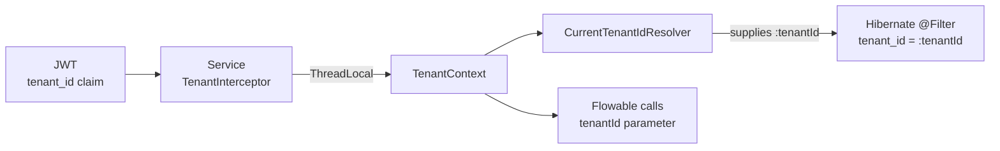
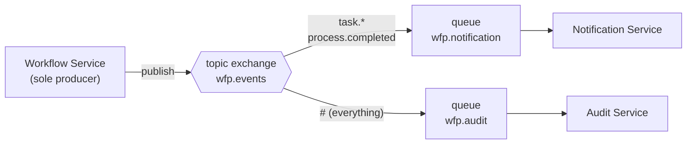

# Architecture Concepts

The ideas you need to hold in your head to work on this repo, and why they are built this way. Diagrams for each level are in the other files in this folder; known pitfalls are in `CLAUDE.md`.

## Multi-Tenancy

Every request carries a tenant id. It originates in the JWT and is enforced at four
separate layers — a break in any one of them is a cross-tenant data leak.

### The chain



| Layer | Mechanism | Lives in |
|---|---|---|
| Edge | `TenantHeaderFilter` strips any client-supplied `X-Tenant-Id` | API Gateway |
| Request | `TenantInterceptor` reads the validated JWT's `tenant_id` claim into `TenantContext` (ThreadLocal) and rejects a token without it (403). No header is trusted | wfp-security |
| JPA | The `tenantFilter` is `autoEnabled` in every Hibernate session and `applyToLoadByKey`, so every query and every load by id from the database gets `tenant_id = :tenantId`. `CurrentTenantIdResolver` supplies the tenant from `TenantContext` and throws when there is none. Inserts are not filtered: the entity's own `tenant_id` is written | entity classes, wfp-security |
| Engine | every Flowable call passes `tenantId`; Flowable stores it in `TENANT_ID_` | Flowable Engine |

### The @FilterDef rule

> [!CAUTION]
> **One `@FilterDef` per persistence unit — not per entity**
> Hibernate registers filter definitions globally. A second `@FilterDef(name = "tenantFilter")`
> in the same service throws at boot. Additional entities declare `@Filter` **only**.

Current owners of the single `@FilterDef` in each service:

| Service | Declares `@FilterDef` | Declare `@Filter` only |
|---|---|---|
| Workflow Service | ProcessMetadata | Comment, Attachment, FieldSchema, FieldValue |
| Notification Service | Notification | NotificationPreference |
| Audit Service | AuditEntry | — |

The single `@FilterDef` must keep `autoEnabled = true`, `applyToLoadByKey = true` and `resolver = CurrentTenantIdResolver.class`; without them the filter silently stops applying.

Code that runs outside a request (RabbitMQ listeners, scheduled jobs) has no tenant until it sets one. Wrap the work in `TenantContext.runAs(tenantId, ...)`; a query without a tenant throws.

Note that FieldOption has no `tenant_id` at all — it is reached only through its
parent `FieldSchema`, which is already filtered.

### Identity side

Each Keycloak user in the single realm carries a `tenant_id` **user attribute**, which a
protocol mapper stamps onto issued tokens as the `tenant_id` claim. Moving tenants to
Keycloak Organizations is planned (#76). See Security and JWT and
Admin — Keycloak Administration.

### See also

Known Pitfalls · Data Model ERD · User — Multi-Tenant Isolation

## Event System

All inter-service communication is asynchronous. There are **no synchronous
service-to-service HTTP calls** in the platform — services share a database instance but
not schemas, and talk only over RabbitMQ.

### Topology



| | |
|---|---|
| Exchange | `wfp.events` (topic) |
| Producer | Workflow Service only |
| Consumers | Notification Service (`wfp.notification`), Audit Service (`wfp.audit`) |
| Contract | wfp-events |

### Routing keys

`process.started` · `process.completed` · `process.cancelled` · `process.sla.breached`
`task.created` · `task.assigned` · `task.completed` · `task.delegated`
`field.schema.created` · `field.value.saved`

The last four are declared in `EventConstants` but **not yet published by any service** —
see Event Catalog for which are live.

### Serialization

`BaseEvent` is polymorphic via `@JsonTypeInfo(use = Id.NAME, property = "eventType")`, so
the JSON body carries its own discriminator and consumers deserialize to the concrete type.

> [!WARNING]
> **Each consumer needs a `Jackson2JsonMessageConverter` bean**
> Without it, Spring AMQP delivers a raw `byte[]` and the listener signature will not match.
> See Known Pitfalls.

### Two publication paths

Events reach the bus by two different routes inside Workflow Service:

1. **Explicit** — `ProcessService` and `TaskService` call `EventPublisher` directly for
   actions the API initiated (`process.started`, `process.cancelled`, `task.completed`,
   `task.delegated`).
2. **Engine-driven** — `FlowableEventListener` subscribes to the Flowable engine event bus
   and forwards engine-originated transitions (`task.created`, `task.assigned`,
   `process.completed`), which no API call directly causes.

### See also

Event Catalog · Admin — RabbitMQ Monitoring · C4 L2 Container

## Security and JWT

Keycloak 25 is the sole identity provider. Every service is an OAuth2 **resource server**;
none of them holds a session.

### Flow

1. The browser runs an OIDC Authorization Code flow against Keycloak
   (realm `workflow-platform`) from Admin Portal or User Portal.
2. The SPA sends the access token as `Authorization: Bearer …` to the API Gateway.
3. The gateway validates the signature against the Keycloak JWK Set.
4. `JwtTenantConverter` maps realm roles to Spring authorities and reads `tenant_id`.
5. `TenantHeaderFilter` strips any client-supplied `X-Tenant-Id`; each service takes the tenant from the JWT itself — see Multi-Tenancy.
6. Each backend service independently re-validates the JWT. **The gateway is not a
   trust boundary the services rely on** — they do not accept unauthenticated traffic
   even if reached directly.

### Public endpoints

Whitelisted in `SecurityConfig`, no token required:

`/actuator/health` · `/actuator/info` · `/v3/api-docs/**` · `/swagger-ui/**`

### Gotcha: the gateway has no database

wfp-security drags in Spring Data JPA. `GatewayApplication` must exclude
`DataSourceAutoConfiguration` and `HibernateJpaAutoConfiguration` or it will not boot.
See Known Pitfalls.

### See also

Admin — Keycloak Administration · API Gateway · User — Login

## Gateway Routing

Four routes, two of which rewrite the path. The asymmetry is deliberate:
Workflow Service exposes generic `/api/**` paths for both workflows and custom fields,
so the gateway namespaces them under `/api/workflow` and `/api/fields`; Notification Service and
Audit Service already expose distinct prefixes and pass through untouched.

| External path | Target | Rewrite |
|---|---|---|
| `/api/workflow/**` | workflow-service:8081 | `RewritePath=/api/workflow(?:/(?<segment>.*))?$, /api/${segment}` |
| `/api/fields/**` | workflow-service:8081 | `RewritePath=/api/fields(?:/(?<segment>.*))?$, /api/${segment}` |
| `/api/notifications/**` | notification-service:8083 | pass-through |
| `/api/audit/**` | audit-service:8084 | pass-through |

So `/api/workflow/tasks` reaches the backend as `/api/tasks`, but
`/api/notifications/unread-count` arrives verbatim.

### Overriding URIs in Docker

Compose sets `SPRING_CLOUD_GATEWAY_MVC_ROUTES_N_URI` per route index. The project also
defines named vars (`WORKFLOW_SERVICE_URL`, `NOTIFICATION_SERVICE_URL`,
`AUDIT_SERVICE_URL`) referenced from `application.yml`,
because indexed env vars silently drop the rest of a route definition when partially
overridden.

> [!TIP]
> **Frontend path bug class**
> A portal calling `/api/tasks` instead of `/api/workflow/tasks` gets a 404 from the
> gateway, not from the service. See Frontend API Path Bug Fix.

### See also

C4 L3 API Gateway · API Endpoint Catalog · Ports and Endpoints

## Flowable Engine

Flowable 7.1.0 runs **embedded, in-process** inside Workflow Service — it is not a
separate container. It shares the `workflow` PostgreSQL schema, where its `ACT_*` tables
sit alongside the application `wf_*` tables.

### Engine services used

| Flowable API | Wrapped by | Purpose |
|---|---|---|
| `RepositoryService` | `DeploymentService` | deploy BPMN XML, list definitions, fetch XML |
| `RuntimeService` | `ProcessService` | start and cancel instances, variables |
| `IdentityService` | `ProcessService` | set authenticated user so the initiator is recorded |
| `TaskService` | `TaskService` | claim, unclaim, complete, delegate |
| `HistoryService` | `ProcessHistoryService` | completed processes and tasks |

### Native tenant support

Flowable stores a `TENANT_ID_` column on its own tables, so tenant isolation for engine
data is handled by passing `tenantId` on every engine call rather than by the Hibernate
filter used for application entities. See Multi-Tenancy.

### Engine events

`FlowableEventListener` subscribes to the engine event bus for `TASK_CREATED`,
`TASK_ASSIGNED` and `PROCESS_COMPLETED` and republishes them to RabbitMQ. These
transitions are caused by the engine advancing a process, not by an API call, so they
cannot be published from a controller. See Event System.

> [!WARNING]
> **H2 test mode**
> Flowable integration tests need `MODE=LEGACY` in the H2 JDBC URL. `MODE=PostgreSQL`
> fails on Flowable schema creation. See Known Pitfalls.

### See also

Workflow Service · Admin — Process Designer · Data Model ERD

## Frontend Architecture

An npm **workspaces** monorepo: two apps, two shared packages, one lockfile.

```
frontend/
├── packages/
│   ├── shared-ui/     → API client, AuthProvider, shared types
│   └── bpmn-editor/   → bpmn-js wrapper + Flowable property provider
└── apps/
    ├── admin-portal/  → depends on both packages
    └── user-portal/   → depends on shared-ui
```

### Build order is not optional

`shared-ui` → `bpmn-editor` → apps. The apps import the packages by workspace name and
resolve to built output, so a clean build that runs the apps first fails on missing
types. Recorded in Known Pitfalls.

```bash
cd frontend
npm ci
npm run build                              # respects the order
npm run typecheck --workspaces --if-present
```

### Auth and API access

Both apps mount `AuthProvider` from shared-ui, which performs the OIDC code flow
against Keycloak and injects the bearer token into `apiClient`. All calls go through the
API Gateway, so every path is prefixed per Gateway Routing.

### Testing posture

TypeScript typecheck only — there is no frontend unit test framework yet.
Behaviour is covered by Playwright at the E2E layer.

### See also

Admin Portal · User Portal · shared-ui · bpmn-editor

## Build System

Gradle 9.2 with the **Groovy DSL** and three convention plugins in `buildSrc/`. No module
configures Java, Lombok or the Spring BOM itself.

| Plugin | Applies to | Provides |
|---|---|---|
| `wfp.java-conventions` | everything | Java 21 toolchain, UTF-8, JUnit 5 |
| `wfp.library-conventions` | `libs/*` | `java-library` + Lombok |
| `wfp.spring-boot-app` | `services/*` | Boot plugin + Lombok + Spring Cloud BOM |

### Commands

```bash
./gradlew build                                       # compile + test everything
./gradlew :services:workflow-service:bootJar -x test  # one service JAR
./gradlew :services:workflow-service:test             # one service test suite
```

> [!WARNING]
> **Dockerfiles must copy the whole `services/` tree**
> `settings.gradle` includes every module, so a build context missing a sibling service
> fails project evaluation — even though that sibling is not being built.
> See Known Pitfalls.

> [!WARNING]
> **`gradlew` needs the executable bit in git**
> `git update-index --chmod=+x gradlew`, or CI fails with permission denied.

### See also

Backend build commands · CI Pipeline · Repository Layout

## Testing Strategy

| Layer | Tooling | Scope |
|---|---|---|
| Backend unit | JUnit 5 | services and mappers |
| Backend integration | **Testcontainers** (PostgreSQL + RabbitMQ) | repositories, listeners, full Spring context |
| Backend web | MockMvc + `JwtTestHelper` | authenticated endpoints |
| BDD acceptance | Cucumber-style features under `tests/` | cross-service behaviour |
| E2E | Playwright (`e2e/`) | both portals against the running stack |
| Frontend | `tsc --noEmit` only | no unit test framework yet |

Integration tests activate `SPRING_PROFILES_ACTIVE=test` and read
`src/test/resources/application-test.yml`.

### Fixtures

wfp-test-support supplies `JwtTestHelper` (mock tokens with tenant and role claims),
`TenantTestHelper` (sets and clears `TenantContext`) and `TestContainersConfig`.

### Traps

- Flowable on H2 requires `MODE=LEGACY` — see Known Pitfalls.
- `EventPublisher` takes a `@Nullable RabbitTemplate` so contexts without RabbitMQ start.
- React component tests must pre-seed the QueryClient cache; a `useQuery` + `useEffect`
  pair otherwise loops forever.

### See also

CI Pipeline · Step 07 — Playwright E2E Tests · Step 11 — Comprehensive E2E Testing and Bug Fixes
