# Data Model Diagram

Entity-relationship diagram covering all JPA entities across the platform's 4 database schemas, plus the Flowable engine's managed tables.

## Entity-Relationship Diagram

```mermaid
erDiagram
    %% ============================================================
    %% WORKFLOW SCHEMA (workflow-service)
    %% ============================================================

    wf_process_metadata {
        uuid id PK
        string process_definition_key "NOT NULL"
        string tenant_id "NOT NULL, filtered"
        string description
        string category
        string icon_url
        instant created_at "NOT NULL, immutable"
        instant updated_at "NOT NULL"
    }

    wf_comments {
        uuid id PK
        string process_instance_id "NOT NULL"
        string task_id "nullable"
        string user_id "NOT NULL"
        text content "NOT NULL"
        instant created_at "NOT NULL, immutable"
        string tenant_id "NOT NULL, filtered"
    }

    wf_attachments {
        uuid id PK
        string process_instance_id "NOT NULL"
        string task_id "nullable"
        string file_name "NOT NULL"
        string content_type "NOT NULL"
        long file_size "NOT NULL"
        string storage_key "NOT NULL"
        string uploaded_by "NOT NULL"
        instant created_at "NOT NULL, immutable"
        string tenant_id "NOT NULL, filtered"
    }

    %% ============================================================
    %% FLOWABLE ENGINE TABLES (managed by Flowable, same schema)
    %% ============================================================

    ACT_RE_DEPLOYMENT {
        string ID_ PK
        string NAME_
        string TENANT_ID_
        timestamp DEPLOY_TIME_
    }

    ACT_RE_PROCDEF {
        string ID_ PK "format: key:version:uuid"
        string KEY_
        string NAME_
        int VERSION_
        string DEPLOYMENT_ID_ FK
        string TENANT_ID_
    }

    ACT_RU_EXECUTION {
        string ID_ PK
        string PROC_DEF_ID_ FK
        string PROC_INST_ID_
        string BUSINESS_KEY_
        string TENANT_ID_
    }

    ACT_RU_TASK {
        string ID_ PK
        string EXECUTION_ID_ FK
        string PROC_INST_ID_
        string PROC_DEF_ID_ FK
        string NAME_
        string ASSIGNEE_
        string TENANT_ID_
        timestamp CREATE_TIME_
        timestamp DUE_DATE_
        int PRIORITY_
    }

    ACT_HI_PROCINST {
        string ID_ PK
        string PROC_DEF_ID_ FK
        string BUSINESS_KEY_
        string START_USER_ID_
        timestamp START_TIME_
        timestamp END_TIME_
        string TENANT_ID_
    }

    ACT_HI_TASKINST {
        string ID_ PK
        string PROC_INST_ID_
        string PROC_DEF_ID_ FK
        string NAME_
        string ASSIGNEE_
        timestamp START_TIME_
        timestamp END_TIME_
        string TENANT_ID_
    }

    %% ============================================================
    %% CUSTOM_FIELDS SCHEMA (custom-fields-service)
    %% ============================================================

    field_schema {
        uuid id PK
        string process_definition_key "NOT NULL"
        string field_key "NOT NULL"
        string label "NOT NULL"
        enum field_type "NOT NULL (TEXT, TEXTAREA, NUMBER, DATE, DATETIME, BOOLEAN, DROPDOWN, MULTI_SELECT, FILE, USER_PICKER)"
        boolean required "NOT NULL"
        int sort_order
        string default_value
        string placeholder
        string validation_regex
        string tenant_id "NOT NULL, filtered"
        instant created_at "immutable"
        instant updated_at
    }

    field_option {
        uuid id PK
        uuid field_schema_id FK "NOT NULL"
        string label "NOT NULL"
        string value "NOT NULL"
        int sort_order
    }

    field_value {
        uuid id PK
        uuid field_schema_id "NOT NULL (logical FK)"
        string process_instance_id "NOT NULL"
        string task_id "nullable"
        text value
        string tenant_id "NOT NULL, filtered"
        instant created_at "immutable"
        instant updated_at
    }

    %% ============================================================
    %% NOTIFICATION SCHEMA (notification-service)
    %% ============================================================

    notification {
        uuid id PK
        string user_id "NOT NULL"
        string tenant_id "NOT NULL, filtered"
        string title "NOT NULL"
        text message
        enum type "NOT NULL (TASK_ASSIGNED, TASK_COMPLETED, PROCESS_COMPLETED, SLA_BREACH, INFO)"
        boolean read "NOT NULL, default false"
        string reference_id "nullable (taskId or processInstanceId)"
        string reference_type "nullable"
        instant created_at "NOT NULL, immutable"
    }

    notification_preference {
        uuid id PK
        string user_id "NOT NULL"
        string tenant_id "NOT NULL, filtered"
        string event_type "NOT NULL"
        boolean email_enabled "default true"
        boolean in_app_enabled "default true"
    }

    %% ============================================================
    %% AUDIT SCHEMA (audit-service)
    %% ============================================================

    audit_entry {
        uuid id PK
        string event_type "NOT NULL"
        string entity_type "NOT NULL"
        string entity_id "NOT NULL"
        string user_id "nullable"
        string tenant_id "NOT NULL, filtered"
        instant timestamp "NOT NULL"
        text details "nullable (JSON)"
        string source_service "nullable"
    }

    %% ============================================================
    %% RELATIONSHIPS
    %% ============================================================

    %% Flowable internal relationships
    ACT_RE_DEPLOYMENT ||--o{ ACT_RE_PROCDEF : "contains"
    ACT_RE_PROCDEF ||--o{ ACT_RU_EXECUTION : "instances"
    ACT_RE_PROCDEF ||--o{ ACT_RU_TASK : "tasks"
    ACT_RE_PROCDEF ||--o{ ACT_HI_PROCINST : "history"
    ACT_RE_PROCDEF ||--o{ ACT_HI_TASKINST : "history"
    ACT_RU_EXECUTION ||--o{ ACT_RU_TASK : "has"

    %% Custom fields relationships
    field_schema ||--o{ field_option : "has options (cascade ALL, orphanRemoval)"
    field_schema ||--o{ field_value : "values reference schema (logical FK)"

    %% Cross-schema logical relationships (no physical FK)
    wf_process_metadata ||--o{ wf_comments : "process has comments (via process_instance_id)"
    wf_process_metadata ||--o{ wf_attachments : "process has attachments (via process_instance_id)"
    notification }o--|| notification_preference : "user preferences per event type (unique: user_id, tenant_id, event_type)"
```

## Schema Overview

| Schema | Service | Tables | Description |
|--------|---------|--------|-------------|
| `workflow` | workflow-service | `wf_process_metadata`, `wf_comments`, `wf_attachments` + ~60 `ACT_*` tables | Process metadata, comments, attachments + Flowable engine |
| `custom_fields` | custom-fields-service | `field_schema`, `field_option`, `field_value` | Dynamic field definitions and values |
| `notification` | notification-service | `notification`, `notification_preference` | User notifications and delivery preferences |
| `audit` | audit-service | `audit_entry` | Immutable audit trail |
| `keycloak` | Keycloak | (managed by Keycloak) | Users, realms, clients, roles, organizations |

## Entity Details

### Enumerations

**FieldType** (custom-fields-service):
| Value | Description |
|-------|-------------|
| `TEXT` | Single-line text input |
| `TEXTAREA` | Multi-line text input |
| `NUMBER` | Numeric input |
| `DATE` | Date picker |
| `DATETIME` | Date + time picker |
| `BOOLEAN` | Checkbox / toggle |
| `DROPDOWN` | Single-select from options |
| `MULTI_SELECT` | Multi-select from options |
| `FILE` | File upload reference |
| `USER_PICKER` | User selection |

**NotificationType** (notification-service):
| Value | Triggered By |
|-------|-------------|
| `TASK_ASSIGNED` | TaskCreatedEvent, TaskAssignedEvent |
| `TASK_COMPLETED` | TaskCompletedEvent |
| `PROCESS_COMPLETED` | ProcessCompletedEvent |
| `SLA_BREACH` | ProcessSlaBreachedEvent (not yet wired) |
| `INFO` | General-purpose notifications |

### Multi-Tenancy Pattern

Every entity (except `field_option`) carries a `tenant_id` column. Hibernate filters enforce row-level isolation:

- **One `@FilterDef` per schema** (on the "root" entity of each service): `ProcessMetadata`, `FieldSchema`, `Notification`, `AuditEntry`
- **`@Filter` only** on additional entities in the same persistence unit: `Comment`, `Attachment`, `FieldValue`, `NotificationPreference`
- `TenantFilterAspect` (from `wfp-security`) auto-enables the filter on every request using the value from `TenantContext`

### Cross-Schema References

There are no physical foreign keys across schemas. Services reference each other's entities by string IDs:

| Source Field | References | Example Value |
|-------------|-----------|---------------|
| `wf_comments.process_instance_id` | Flowable `ACT_RU_EXECUTION.PROC_INST_ID_` | `"12345"` |
| `wf_comments.task_id` | Flowable `ACT_RU_TASK.ID_` | `"67890"` |
| `field_value.field_schema_id` | `field_schema.id` (same schema, logical FK) | UUID |
| `field_value.process_instance_id` | Flowable `ACT_RU_EXECUTION.PROC_INST_ID_` | `"12345"` |
| `notification.reference_id` | Flowable task or process ID | `"12345"` |
| `audit_entry.entity_id` | Any Flowable entity ID | `"12345"` |

## Notes for Editors

- **Adding a new entity**: Add it to the ER diagram in the appropriate schema section. Use `@Filter` (not `@FilterDef`) if the service already has a `@FilterDef` entity. Add a row to the Schema Overview table.
- **Adding a physical FK across schemas**: This would couple services at the database level — the current design deliberately avoids this. If you need it, document the trade-off.
- **Adding a new field type**: Add the value to the `FieldType` enum and update the Enumerations table above.
- **Flowable tables**: Only the most relevant `ACT_*` tables are shown. Flowable manages ~60 tables total (`ACT_RE_*` for repository, `ACT_RU_*` for runtime, `ACT_HI_*` for history, `ACT_GE_*` for general). See [Flowable docs](https://www.flowable.com/open-source/docs/bpmn/ch03-Configuration#database-table-names-explained) for the full schema.
