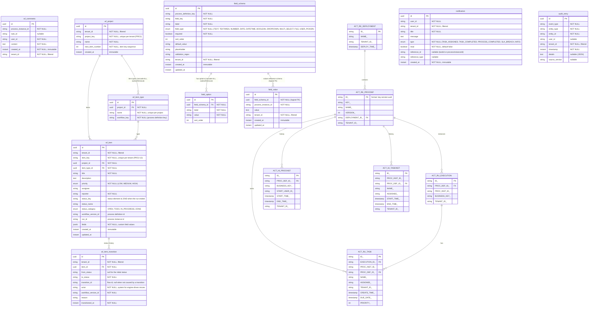

# Data Model Diagram

Entity-relationship diagram covering all JPA entities across the platform's 4 database schemas, plus the Flowable engine's managed tables.

## Entity-Relationship Diagram

```mermaid
erDiagram
    %% ============================================================
    %% WORKFLOW SCHEMA (app)
    %% ============================================================


    wf_comments {
        uuid id PK
        string process_instance_id "NOT NULL"
        string task_id "nullable"
        string user_id "NOT NULL"
        text content "NOT NULL"
        instant created_at "NOT NULL, immutable"
        string tenant_id "NOT NULL, filtered"
    }


    wf_project {
        uuid id PK
        string tenant_id "NOT NULL, filtered"
        string project_key "NOT NULL, unique per tenant (PROJ)"
        string name "NOT NULL"
        int next_item_number "NOT NULL, item key sequence"
        instant created_at "immutable"
    }

    wf_item_type {
        uuid id PK
        uuid project_id FK "NOT NULL"
        string name "NOT NULL, unique per project"
        string workflow_key "NOT NULL (process definition key)"
    }

    wf_item {
        uuid id PK
        string tenant_id "NOT NULL, filtered"
        string item_key "NOT NULL, unique per tenant (PROJ-12)"
        uuid project_id FK "NOT NULL"
        uuid item_type_id FK "NOT NULL"
        string title "NOT NULL"
        text description
        enum priority "NOT NULL (LOW, MEDIUM, HIGH)"
        string assignee
        string reporter "NOT NULL"
        string status_key "status element id, END when the run ended"
        string status_name
        enum status_category "OPEN, TODO, IN_PROGRESS, DONE"
        string workflow_version_id "process definition id"
        string run_id "process instance id"
        jsonb fields "NOT NULL, custom field values"
        instant created_at "immutable"
        instant updated_at
    }

    wf_item_transition {
        uuid id PK
        string tenant_id "NOT NULL, filtered"
        uuid item_id FK "NOT NULL"
        string from_status "null for the initial status"
        string to_status "NOT NULL"
        string transition_id "flow id, null when not caused by a transition"
        string actor "NOT NULL, system for engine-driven moves"
        string workflow_version_id "NOT NULL"
        string reason
        instant transitioned_at "NOT NULL"
    }

    %% ============================================================
    %% FLOWABLE ENGINE TABLES (managed by Flowable, same schema)
    %% ============================================================

    ACT_RE_DEPLOYMENT {
        string ID_ PK
        string NAME_
        string TENANT_ID_
        timestamp DEPLOY_TIME_
    }

    ACT_RE_PROCDEF {
        string ID_ PK "format: key:version:uuid"
        string KEY_
        string NAME_
        int VERSION_
        string DEPLOYMENT_ID_ FK
        string TENANT_ID_
    }

    ACT_RU_EXECUTION {
        string ID_ PK
        string PROC_DEF_ID_ FK
        string PROC_INST_ID_
        string BUSINESS_KEY_
        string TENANT_ID_
    }

    ACT_RU_TASK {
        string ID_ PK
        string EXECUTION_ID_ FK
        string PROC_INST_ID_
        string PROC_DEF_ID_ FK
        string NAME_
        string ASSIGNEE_
        string TENANT_ID_
        timestamp CREATE_TIME_
        timestamp DUE_DATE_
        int PRIORITY_
    }

    ACT_HI_PROCINST {
        string ID_ PK
        string PROC_DEF_ID_ FK
        string BUSINESS_KEY_
        string START_USER_ID_
        timestamp START_TIME_
        timestamp END_TIME_
        string TENANT_ID_
    }

    ACT_HI_TASKINST {
        string ID_ PK
        string PROC_INST_ID_
        string PROC_DEF_ID_ FK
        string NAME_
        string ASSIGNEE_
        timestamp START_TIME_
        timestamp END_TIME_
        string TENANT_ID_
    }

    %% ============================================================
    %% CUSTOM FIELDS (workflow schema, app)
    %% ============================================================

    field_schema {
        uuid id PK
        string process_definition_key "NOT NULL"
        string field_key "NOT NULL"
        string label "NOT NULL"
        enum field_type "NOT NULL (TEXT, TEXTAREA, NUMBER, DATE, DATETIME, BOOLEAN, DROPDOWN, MULTI_SELECT, FILE, USER_PICKER)"
        boolean required "NOT NULL"
        int sort_order
        string default_value
        string placeholder
        string validation_regex
        string tenant_id "NOT NULL, filtered"
        instant created_at "immutable"
        instant updated_at
    }

    field_option {
        uuid id PK
        uuid field_schema_id FK "NOT NULL"
        string label "NOT NULL"
        string value "NOT NULL"
        int sort_order
    }

    field_value {
        uuid id PK
        uuid field_schema_id "NOT NULL (logical FK)"
        string process_instance_id "NOT NULL"
        text value
        string tenant_id "NOT NULL, filtered"
        instant created_at "immutable"
        instant updated_at
    }

    %% ============================================================
    %% NOTIFICATIONS (workflow schema, app)
    %% ============================================================

    notification {
        uuid id PK
        string user_id "NOT NULL"
        string tenant_id "NOT NULL, filtered"
        string title "NOT NULL"
        text message
        enum type "NOT NULL (TASK_ASSIGNED, TASK_COMPLETED, PROCESS_COMPLETED, SLA_BREACH, INFO)"
        boolean read "NOT NULL, default false"
        string reference_id "nullable (taskId or processInstanceId)"
        string reference_type "nullable"
        instant created_at "NOT NULL, immutable"
    }

    %% ============================================================
    %% AUDIT (workflow schema, app)
    %% ============================================================

    audit_entry {
        uuid id PK
        string event_type "NOT NULL"
        string entity_type "NOT NULL"
        string entity_id "NOT NULL"
        string user_id "nullable"
        string tenant_id "NOT NULL, filtered"
        instant timestamp "NOT NULL"
        text details "nullable (JSON)"
        string source_service "nullable"
    }

    %% ============================================================
    %% RELATIONSHIPS
    %% ============================================================

    %% Flowable internal relationships
    ACT_RE_DEPLOYMENT ||--o{ ACT_RE_PROCDEF : "contains"
    ACT_RE_PROCDEF ||--o{ ACT_RU_EXECUTION : "instances"
    ACT_RE_PROCDEF ||--o{ ACT_RU_TASK : "tasks"
    ACT_RE_PROCDEF ||--o{ ACT_HI_PROCINST : "history"
    ACT_RE_PROCDEF ||--o{ ACT_HI_TASKINST : "history"
    ACT_RU_EXECUTION ||--o{ ACT_RU_TASK : "has"

    %% Work item relationships
    wf_project ||--o{ wf_item_type : "item types (cascade ALL, orphanRemoval)"
    wf_project ||--o{ wf_item : "items"
    wf_item_type ||--o{ wf_item : "type"
    wf_item ||--o{ wf_item_transition : "status history"

    %% Custom fields relationships
    field_schema ||--o{ field_option : "has options (cascade ALL, orphanRemoval)"
    field_schema ||--o{ field_value : "values reference schema (logical FK)"

    %% Cross-schema logical relationships (no physical FK)
```

## Schema Overview

| Schema | Service | Tables | Description |
|--------|---------|--------|-------------|
| `workflow` | app | `wf_project`, `wf_item_type`, `wf_item`, `wf_item_transition`, `wf_comments`, `field_schema`, `field_option`, `field_value`, `notification`, `audit_entry` + ~60 `ACT_*` tables | Projects, work items and their status history, comments, custom field definitions and values, in-app notifications, audit trail + Flowable engine |
| `keycloak` | Keycloak | (managed by Keycloak) | Users, realms, clients, roles, organizations |

## Entity Details

### Enumerations

**FieldType** (app):
| Value | Description |
|-------|-------------|
| `TEXT` | Single-line text input |
| `TEXTAREA` | Multi-line text input |
| `NUMBER` | Numeric input |
| `DATE` | Date picker |
| `DATETIME` | Date + time picker |
| `BOOLEAN` | Checkbox / toggle |
| `DROPDOWN` | Single-select from options |
| `MULTI_SELECT` | Multi-select from options |
| `FILE` | File upload reference |
| `USER_PICKER` | User selection |

**NotificationType** (app):
| Value | Triggered By |
|-------|-------------|
| `TASK_ASSIGNED` | TaskCreatedEvent, TaskAssignedEvent |
| `TASK_COMPLETED` | TaskCompletedEvent |
| `PROCESS_COMPLETED` | not produced (kept for stored values and the UI) |
| `SLA_BREACH` | not produced yet (item SLA timers, tracker) |
| `INFO` | General-purpose notifications |
| `ITEM_ASSIGNED` | A work item is created with, or changed to, an assignee other than the actor |
| `ITEM_TRANSITIONED` | A work item changes status; sent to its reporter and assignee, except the actor |

### Multi-Tenancy Pattern

Every entity (except `field_option` and `wf_item_type`) carries a `tenant_id` column. Hibernate filters enforce row-level isolation:

- **One package-level `@FilterDef`** in `com/wfp/workflow/entity/package-info.java`
- **`@Filter` only** on every tenant-scoped entity: `Project`, `Item`, `ItemTransition`, `Comment`, `FieldSchema`, `FieldValue`, `Notification`, `AuditEntry`
- The filter is `autoEnabled` and `applyToLoadByKey`, so Hibernate applies it to every query and every load by id from the database, in every session; `CurrentTenantIdResolver` (`com.wfp.security`) supplies the tenant from `TenantContext` and throws when none is set

### Cross-Schema References

There are no physical foreign keys across schemas. Services reference each other's entities by string IDs:

| Source Field | References | Example Value |
|-------------|-----------|---------------|
| `wf_comments.process_instance_id` | Flowable `ACT_RU_EXECUTION.PROC_INST_ID_` | `"12345"` |
| `wf_comments.task_id` | Flowable `ACT_RU_TASK.ID_` | `"67890"` |
| `field_value.field_schema_id` | `field_schema.id` (same schema, logical FK) | UUID |
| `field_value.process_instance_id` | Flowable `ACT_RU_EXECUTION.PROC_INST_ID_` | `"12345"` |
| `wf_item.run_id` | Flowable `ACT_RU_EXECUTION.PROC_INST_ID_` | `"12345"` |
| `wf_item.workflow_version_id` | Flowable `ACT_RE_PROCDEF.ID_` | `"simple:1:42"` |
| `notification.reference_id` | Flowable task or process ID | `"12345"` |
| `audit_entry.entity_id` | Any Flowable entity ID | `"12345"` |

## Notes for Editors

- **Adding a new entity**: Add it to the ER diagram in the appropriate schema section. Use `@Filter` (not `@FilterDef`) if the service already has a `@FilterDef` entity. Add a row to the Schema Overview table.
- **Adding a physical FK across schemas**: This would couple services at the database level — the current design deliberately avoids this. If you need it, document the trade-off.
- **Adding a new field type**: Add the value to the `FieldType` enum and update the Enumerations table above.
- **Flowable tables**: Only the most relevant `ACT_*` tables are shown. Flowable manages ~60 tables total (`ACT_RE_*` for repository, `ACT_RU_*` for runtime, `ACT_HI_*` for history, `ACT_GE_*` for general). See [Flowable docs](https://www.flowable.com/open-source/docs/bpmn/ch03-Configuration#database-table-names-explained) for the full schema.
