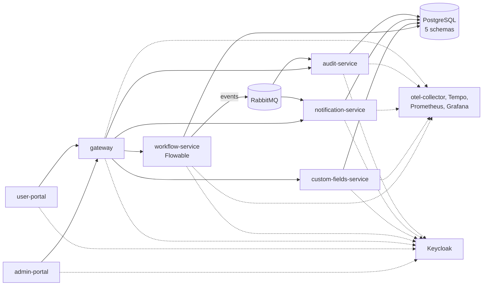
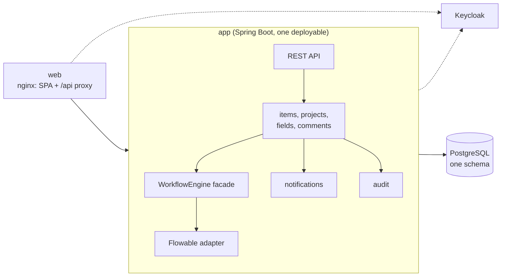

# Tracker Architecture

Status: **removal candidates decided on 2026-10-01**: R-1 to R-12 approved, R-11 subject to a check in 20.a. Tenant identity and the delivery order decided the same day. BPMN stays: Flowable behind the `WorkflowEngine` facade (20.5) and the bpmn-js editor. Screens are in [tracker-screens.md](tracker-screens.md); the tracker's behaviour is in [work-item-tracker.md](work-item-tracker.md).

## Today

| Part | Count |
|---|---|
| Spring Boot services | 5 (gateway, workflow, custom-fields, notification, audit) |
| Containers in `docker-compose.yml` | 14 |
| Helm charts | 8, plus the umbrella chart |
| Shared Java libraries | 4 (`wfp-common`, `wfp-events`, `wfp-security`, `wfp-test-support`) |
| Frontend units | 2 apps + 2 packages, which must build in order (pitfall 7) |
| Database schemas | `workflow`, `custom_fields`, `notification`, `audit`, plus `keycloak` |

Facts found while preparing this document, which the proposal relies on:

- **RabbitMQ has one producer and two consumers.** `workflow-service` publishes; `audit-service` and `notification-service` consume. `custom-fields-service` declares a RabbitMQ config but neither publishes nor consumes. `EventPublisher` sends during the request, not after commit, so an event can go out for a rolled-back change, or be lost if the broker is down.
- **Notifications are not real-time.** There is no WebSocket, SSE or email sending. `notification-service` stores rows that the UI reads over REST. The mail and Thymeleaf dependencies are unused, `templates/email` is empty, and `NotificationPreference` is never read.
- **Unused code:** the `Attachment` entity (no API), `ProcessMetadata` (never read or written), and the declared-but-unused `field.*` and `process.sla.breached` events.
- **The gateway only routes** `/api/*` to the four services. It also validates the JWT (each service validates it again), sets CORS, and strips `X-Tenant-Id`, which has had no effect since #55 took the tenant only from the JWT.
- **Roles are defined but never enforced** (#72), and **task and process writes don't check the tenant** (#71).

## Proposal

One backend service and one web app, next to PostgreSQL and Keycloak.

- **One transaction per user action.** Creating or moving an item writes the item, its engine state, the transition row, the field-change rows, the notification rows and the audit row together. There are no events to publish, lose or retry. This follows the "data that must change together belongs in one service and one transaction" agreement in `CLAUDE.md`.
- **The facade stays the only replaceable boundary.** An ArchUnit rule keeps `org.flowable` inside the adapter package (20.5). Items, projects, fields, notifications and audit are plain packages; they are not modules or services.
- **The web container serves the SPA and proxies `/api`** to `app`, so the browser sees one origin and needs no CORS. In Kubernetes an Ingress does the same routing.

| Part | Today | Proposed |
|---|---|---|
| Spring Boot services | 5 | 1 |
| Containers in the core stack | 14 | 4 (web, app, PostgreSQL, Keycloak); observability becomes an optional profile |
| Helm charts | 8 + umbrella | 1 chart with 2 deployments |
| Shared Java libraries | 4 | 0; they become packages in `app` |
| Frontend units | 2 apps + 2 packages | 1 app |
| Message broker | RabbitMQ | none |

## Removal candidates

| # | Candidate | Proposal | What we give up | Recommendation | Decision (2026-10-01) |
|---|---|---|---|---|---|
| R-1 | `custom-fields-service` | Fold into `app`. Definitions move into `app`, and values become a `jsonb` column on `wf_item` (already decided, 20.1 and 20.g) | Nothing | **Remove** | Approved |
| R-2 | `notification-service` | Fold into `app`. A `notification` row is written in the same transaction as the change that causes it; the bell polls (screen S-7). Watchers and @mentions (20.8) later land in the same place | Independent scaling of notifications, which isn't needed at this size | **Remove** | Approved |
| R-3 | `audit-service` | Fold into `app`. Item history is `wf_item_transition` plus field-change rows; admin actions (deploy, fields, projects) write an `audit_entry` row in their own transaction. Audit can no longer miss a change or record one that rolled back | A separate audit store that application code can't touch | **Remove** | Approved |
| R-4 | RabbitMQ and `wfp-events` | Remove once R-2 and R-3 land, when nothing consumes events any more. That also closes #65 (dead-letter queue) and makes #30 (trace propagation across RabbitMQ) moot | An integration point for future external consumers. If one appears, add a transactional outbox then | **Remove** | Approved |
| R-5 | `gateway` | Remove. The web container proxies `/api` locally, an Ingress does it in Kubernetes, and `app` keeps validating the JWT | A central place for rate limiting or request filtering; neither is used today | **Remove** | Approved |
| R-6 | Two portals, `shared-ui`, `bpmn-editor` packages | One app (screen S-1). The two packages become folders in the app, which removes the build-order pitfall | Separately deployable admin and user UIs | **Remove** | Approved |
| R-7 | `wfp-common`, `wfp-security`, `wfp-test-support` | Become packages in `app`; they only existed to share code between services | Nothing, with one service | **Remove** | Approved |
| R-8 | Dead code | Remove `Attachment` (screen S-5), `ProcessMetadata` (projects replace it), `NotificationPreference`, the mail and Thymeleaf dependencies, the empty email templates, and the process, task and history endpoints and DTOs that the item API replaces (20.7) | Nothing in use | **Remove** | Approved |
| R-9 | Per-service database schemas | One schema, one Flyway history. **Assumption: no environment holds data worth migrating** (nothing is deployed; GCP is parked), so the local database is recreated instead of migrated | Nothing, if the assumption holds | **Remove, confirm the assumption** | Approved |
| R-10 | Local observability stack (otel-collector, Tempo, Prometheus, Grafana) | Move to an optional compose profile (`--profile observability`). With one service, request tracing across services is gone, but database and HTTP spans stay. Rescope the GCP observability phase (now Phase 3) afterwards | Always-on local traces and dashboards | **Make optional** (not delete) | Approved |
| R-11 | Flowable history tables | The platform never reads engine history (20.2), so set `flowable.history-level: none`. First verify in the 20.a spike that moving items between versions (20.4) doesn't need it | The engine's own audit trail, which duplicates `wf_item_transition` | **Decide in 20.a** | **Approved, verify in 20.a**: moving an item to a new version (`moveActivityIdTo`) must work with history off; if it doesn't, history stays on. `wf_item_transition` is the item history either way; its view comes in a later phase (#75) |
| R-12 | The `manager` role | Unused. Proposed roles: `admin` (tenant administration: projects, workflows, fields, audit log) and `user` (items). Enforced in the backend (#72) | A middle role, until someone needs one | **Remove** | Approved |

**Kept, because each is a standard the stack already relies on:** BPMN with Flowable behind the facade, bpmn-js, Keycloak, PostgreSQL with `jsonb`, Flyway, and the Hibernate tenant filter.

## Multi-tenancy in the target

The chain is today's, minus the gateway:

1. The Keycloak token carries `tenant_id`, from a user attribute. **Decided 2026-10-01:** keep the attribute for now; moving tenants to Keycloak Organizations is in Phase 2 (#76). To keep that move free of data migration, each organization's alias will equal today's tenant id.
2. `TenantInterceptor` puts the tenant in `TenantContext` and rejects a token without one.
3. JPA: the auto-enabled Hibernate filter applies the tenant to every query and load by id, and fails closed without a tenant (#58, #66).
4. Flowable: every call passes the tenant. The facade's `transition` and `cancel` must check that the run belongs to the caller's tenant, which is exactly what #71 fixes today.
5. Roles are enforced in `app` (#72, R-12).

## Delivery order

**Approved 2026-10-01.** Folding the services should happen **before** the item model (20.c). Otherwise 20.c builds `item.*` events over RabbitMQ that R-2 to R-4 then delete.

| Step | Content | Done when |
|---|---|---|
| 20.a | Spike, unchanged: parser, profile validator, `describe()`. Also verifies R-11 | as in 20.6, plus R-11 confirmed or reverted |
| C-1 | Fold custom-fields, notification and audit into `workflow-service` (renamed `app`); remove RabbitMQ and `wfp-events`; libraries become packages; one schema (R-1 to R-4, R-7, R-9). Today's screens keep working | BDD and Playwright green; 2 backend containers left (gateway, app) |
| C-2 | Remove the gateway; the portals' nginx proxies `/api` (R-5) | BDD and Playwright green through the new URLs; no gateway container |
| 20.b | Facade extraction, with the tenant check from #71 inside `transition` and `cancel` | as in 20.6 |
| 20.c | Item model. History, notification and audit rows are written in the same transaction, with no events | as in 20.6 |
| 20.d | Editor guardrails | as in 20.6 |
| 20.e | The new single app with the approved screens; delete `admin-portal` and `user-portal` (R-6, R-8 UI parts) | Playwright flow from 20.6 |
| 20.f | Moving items to a new version. **Moved to Phase 2: Tracker follow-ups** (#41); until then, open items stay on their version | as in 20.6 |

20.g is absorbed into C-1. #71 is fixed now, ahead of this order; #72 (roles) is part of 20.e.

## Risks

- **One deployable:** a bad release takes down everything, and the API and Flowable's job executor scale together. At the current size that's acceptable, and it's easier to operate than five services.
- **C-1 is the largest step.** It touches Docker, Helm, CI, the BDD and E2E base URLs, and `docs/architecture/`. Folding one service per PR keeps each step reviewable: custom-fields first, then notification, then audit and RabbitMQ.
- **Reversing it:** if a part needs to scale on its own later, the package boundaries are where a service would be cut out again, with an outbox for events.
