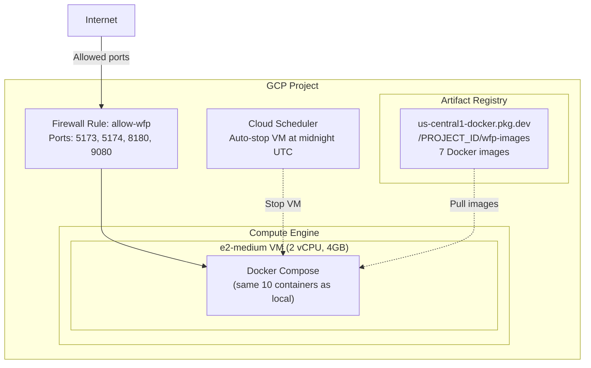

[[Architecture MOC]] › [[Deployment Topologies]] › **Deployment — GCP**

Single Compute Engine VM running the same Docker Compose stack.

## GCP Configuration

| Resource | Spec | Notes |
|----------|------|-------|
| VM Instance | `e2-medium` (2 vCPU, 4GB) | Min viable for 10 containers; e2-small causes OOM |
| Disk | 30 GB `pd-standard` | OS + Docker images + data |
| Region | `us-central1-a` | - |
| Firewall | Ports 5173, 5174, 8180, 9080 | Tag: `wfp-server` |
| Auto-stop | Cloud Scheduler at midnight UTC | Cost savings (~$1/month when stopped) |
| Running cost | ~$25/month | e2-medium on-demand |

## GCP-Specific Overrides

| Config | Local Value | GCP Value |
|--------|------------|-----------|
| JWT Issuer URI | `http://localhost:8180/...` | `http://{EXTERNAL_IP}:8180/...` |
| [[Security and JWT|Keycloak]] `KC_HOSTNAME` | `localhost` | `{EXTERNAL_IP}` |
| Frontend `VITE_KEYCLOAK_URL` | `http://localhost:8180` | `http://{EXTERNAL_IP}:8180` |

---

---

**Deployment topologies** — ← [[Deployment — Docker Compose]] · [[Deployment — Kubernetes]] →

> [!abstract]- All notes in this set
> [[Deployment — Docker Compose]]
> [[Deployment — Kubernetes]]
