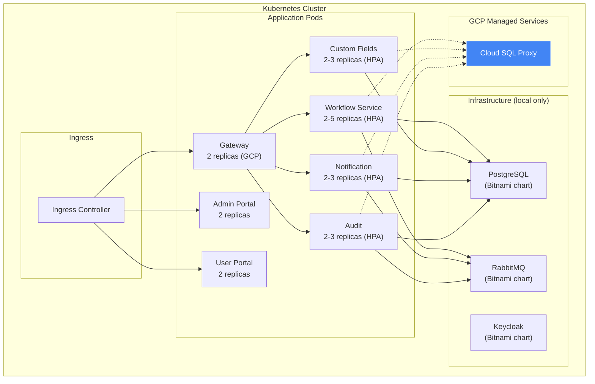

[[Architecture MOC]] › [[Deployment Topologies]] › **Deployment — Kubernetes**

Umbrella [[Helm and Kubernetes|Helm]] chart with 10 sub-charts. Supports local (minikube) and GCP production profiles.

## Helm Values Profiles

| Profile | File | Infra Charts | Replicas | Autoscaling |
|---------|------|-------------|----------|-------------|
| Local | `values-local.yaml` | Enabled (Bitnami PG, RMQ, KC) | 1 each | No |
| GCP | `values-gcp.yaml` | Disabled (managed services) | 2+ each | Yes (HPA) |

## Resource Allocation (GCP)

| Service | CPU Request | CPU Limit | Memory Request | Memory Limit | Min/Max Replicas |
|---------|------------|-----------|---------------|-------------|-----------------|
| Gateway | 250m | 500m | 256Mi | 512Mi | 2 / 5 |
| [[Workflow Service]] | 500m | 1000m | 512Mi | 1Gi | 2 / 5 |
| Custom Fields | 250m | 500m | 512Mi | 1Gi | 2 / 3 |
| Notification | 250m | 500m | 512Mi | 1Gi | 2 / 3 |
| Audit | 250m | 500m | 512Mi | 1Gi | 2 / 3 |
| [[Admin Portal]] | 50m | 200m | 64Mi | 128Mi | 2 / - |
| [[User Portal]] | 50m | 200m | 64Mi | 128Mi | 2 / - |

---

**Deployment topologies** — ← [[Deployment — GCP]]

> [!abstract]- All notes in this set
> [[Deployment — Docker Compose]]
> [[Deployment — GCP]]
