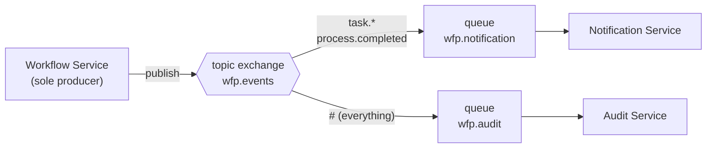

All inter-service communication is asynchronous. There are **no synchronous
service-to-service HTTP calls** in the platform — services share a database instance but
not schemas, and talk only over RabbitMQ.

## Topology

| | |
|---|---|
| Exchange | `wfp.events` (topic) |
| Producer | [[Workflow Service]] only |
| Consumers | [[Notification Service]] (`wfp.notification`), [[Audit Service]] (`wfp.audit`) |
| Contract | [[wfp-events]] |

## Routing keys

`process.started` · `process.completed` · `process.cancelled` · `process.sla.breached`
`task.created` · `task.assigned` · `task.completed` · `task.delegated`
`field.schema.created` · `field.value.saved`

The last four are declared in `EventConstants` but **not yet published by any service** —
see [[Event Catalog]] for which are live.

## Serialization

`BaseEvent` is polymorphic via `@JsonTypeInfo(use = Id.NAME, property = "eventType")`, so
the JSON body carries its own discriminator and consumers deserialize to the concrete type.

> [!warning] Each consumer needs a `Jackson2JsonMessageConverter` bean
> Without it, Spring AMQP delivers a raw `byte[]` and the listener signature will not match.
> See [[Known Pitfalls]].

## Two publication paths

Events reach the bus by two different routes inside [[Workflow Service]]:

1. **Explicit** — `ProcessService` and `TaskService` call `EventPublisher` directly for
   actions the API initiated (`process.started`, `process.cancelled`, `task.completed`,
   `task.delegated`).
2. **Engine-driven** — `FlowableEventListener` subscribes to the [[Flowable Engine|Flowable engine]] event bus
   and forwards engine-originated transitions (`task.created`, `task.assigned`,
   `process.completed`), which no API call directly causes.

## See also

[[Event Catalog]] · [[Admin — RabbitMQ Monitoring]] · [[C4 L2 Container]]
