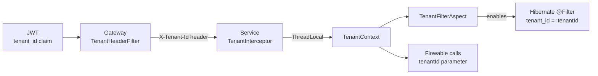

Every request carries a tenant id. It originates in the JWT and is enforced at four
separate layers — a break in any one of them is a cross-tenant data leak.

## The chain

| Layer | Mechanism | Lives in |
|---|---|---|
| Edge | `TenantHeaderFilter` reads the `tenant_id` claim, sets `X-Tenant-Id` | [[API Gateway]] |
| Request | `TenantInterceptor` reads the header into `TenantContext` (ThreadLocal) | [[wfp-security]] |
| JPA | `@FilterDef`/`@Filter` auto-append `tenant_id = :tenantId` | entity classes |
| Engine | every Flowable call passes `tenantId`; Flowable stores it in `TENANT_ID_` | [[Flowable Engine]] |

## The @FilterDef rule

> [!danger] One `@FilterDef` per persistence unit — not per entity
> Hibernate registers filter definitions globally. A second `@FilterDef(name = "tenantFilter")`
> in the same service throws at boot. Additional entities declare `@Filter` **only**.

Current owners of the single `@FilterDef` in each service:

| Service | Declares `@FilterDef` | Declare `@Filter` only |
|---|---|---|
| [[Workflow Service]] | [[ProcessMetadata]] | [[Comment]], [[Attachment]] |
| [[Custom Fields Service]] | [[FieldSchema]] | [[FieldValue]] |
| [[Notification Service]] | [[Notification]] | [[NotificationPreference]] |
| [[Audit Service]] | [[AuditEntry]] | — |

Note that [[FieldOption]] has no `tenant_id` at all — it is reached only through its
parent `FieldSchema`, which is already filtered.

## Identity side

[[Security and JWT|Keycloak]] models tenants as **Organizations** inside a single realm, and stamps the
`tenant_id` claim onto issued tokens. See [[Security and JWT]] and
[[Admin — Keycloak Administration]].

## See also

[[Known Pitfalls]] · [[Data Model ERD]] · [[User — Multi-Tenant Isolation]]
