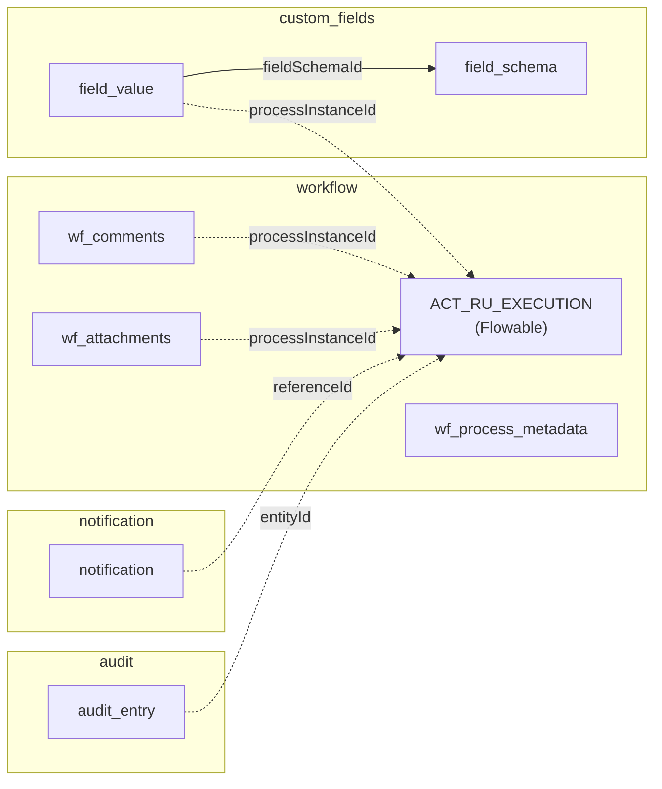

All nine JPA entities across four schemas. [[Flowable Engine|Flowable]] `ACT_*` tables are engine-managed and
not mapped — see [[Flowable Engine]].

| Entity | Table | Schema | Service | Tenant column |
|---|---|---|---|---|
| [[ProcessMetadata]] | `wf_process_metadata` | `workflow` | [[Workflow Service]] | ✅ `@FilterDef` |
| [[Comment]] | `wf_comments` | `workflow` | [[Workflow Service]] | ✅ |
| [[Attachment]] | `wf_attachments` | `workflow` | [[Workflow Service]] | ✅ |
| [[FieldSchema]] | `field_schema` | `custom_fields` | [[Custom Fields Service]] | ✅ `@FilterDef` |
| [[FieldOption]] | `field_option` | `custom_fields` | [[Custom Fields Service]] | ❌ via parent |
| [[FieldValue]] | `field_value` | `custom_fields` | [[Custom Fields Service]] | ✅ |
| [[Notification]] | `notification` | `notification` | [[Notification Service]] | ✅ `@FilterDef` |
| [[NotificationPreference]] | `notification_preference` | `notification` | [[Notification Service]] | ✅ |
| [[AuditEntry]] | `audit_entry` | `audit` | [[Audit Service]] | ✅ `@FilterDef` |

## Cross-schema references (no FKs)

Dotted edges cross a schema boundary and carry **no referential integrity** — they are
string ids. Deleting a process instance orphans rows in three other schemas.

## See also

[[Data Model ERD]] · [[Enumerations]] · [[Multi-Tenancy]]
