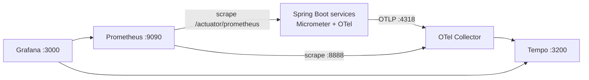

[[Operations MOC]] › **Observability Stack**

OpenTelemetry traces, Prometheus metrics and structured JSON logs, correlated by trace id.

## What each service exposes

`management.endpoints.web.exposure.include: health, info, prometheus, metrics`, every
metric tagged `application=<service name>`, tracing sampled at `1.0` and exported to
`${OTEL_EXPORTER_OTLP_ENDPOINT}/v1/traces`.

> [!note] Sampling is 100%
> Fine locally; lower `management.tracing.sampling.probability` before production.

## Trace–log correlation

Trace and span ids are placed in the MDC and emitted in the JSON log line, so a trace in
Grafana can be pivoted to the exact log entries. Verification detail:
[[Observability — 6 MDC Context Propagation]] and
[[Observability — 5 Full Observability Stack Verified]].

## See also

[[Observability — Summary]] · [[Observability — Architecture for GCP]] · [[Ports and Endpoints]]

---

**Running and shipping** — ← [[Helm and Kubernetes]] · [[Ports and Endpoints]] →

> [!abstract]- All notes in this set
> [[Prerequisites]]
> [[Quick Start]]
> [[Local Development]]
> [[Tech Stack]]
> [[Repository Layout]]
> [[Build Commands]]
> [[Docker Compose Stack]]
> [[CI Pipeline]]
> [[Helm and Kubernetes]]
> [[Ports and Endpoints]]
