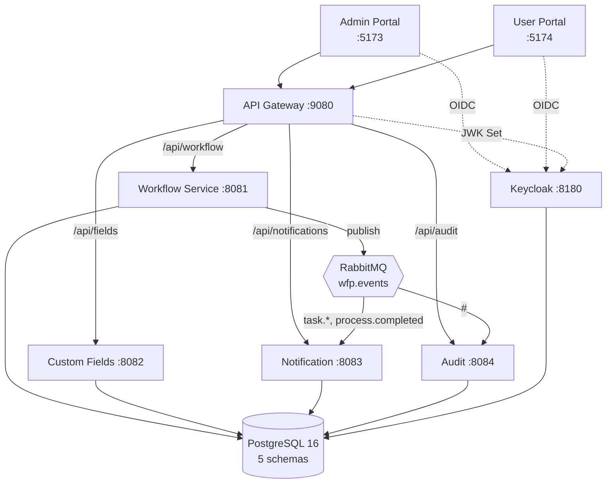

> [!abstract] Workflow Platform
> Multi-tenant BPMN workflow platform. Admins design workflows visually with bpmn-js and
> deploy them; end users complete tasks through an inbox. Every action is audited, custom
> fields attach to any process, notifications arrive in real time.
>
> Java 21 · Spring Boot 3.3.5 · Flowable 7.1 · PostgreSQL 16 · RabbitMQ 3.13 · Keycloak 25 · React 18

## Start here

| I want to… | Go to |
|---|---|
| Understand the system | [[C4 L2 Container]] → [[Architecture MOC]] |
| Understand a decision | [[Concepts MOC]] |
| Find an endpoint, event or table | [[Reference MOC]] |
| Run or deploy it | [[Operations MOC]] |
| Use the product | [[Manuals MOC]] |
| Know what is left to do | [[Project MOC]] |
| See what it looks like | [[Screenshot Gallery]] |

## The system in one diagram

## The four things that will bite you

1. **One `@FilterDef` per persistence unit** — not per entity. [[Multi-Tenancy]]
2. **Frontend build order** — `shared-ui` → `bpmn-editor` → apps. [[Frontend Architecture]]
3. **Dockerfiles copy the whole `services/` tree** — `settings.gradle` includes every module. [[Build System]]
4. **Gateway paths are rewritten** — `/api/workflow/tasks`, not `/api/tasks`. [[Gateway Routing]]

Full list: [[Known Pitfalls]].

## Vault layout

| Folder | Contents |
|---|---|
| `00-Index` | Hub notes — start from one of these |
| `10-Architecture` | C4 diagrams and the ERD (Mermaid, renders natively) |
| `20-Services` | One note per deployable and per shared library |
| `30-Concepts` | The ideas behind the code |
| `35-Reference` | Generated from source: endpoints, events, entities, enums |
| `40-Operations` | Build, run, deploy, observe, troubleshoot |
| `50-Manuals` | Admin and end-user documentation |
| `60-Project` | Plan, status, gaps |

> [!info] Regenerating
> Notes tagged `type: reference` and the `20-Services` notes are derived from the source
> tree; their `source:` frontmatter names the files they came from. `50-Manuals` and
> `60-Project` are split from `docs/*.md` and `PLAN.md`.
